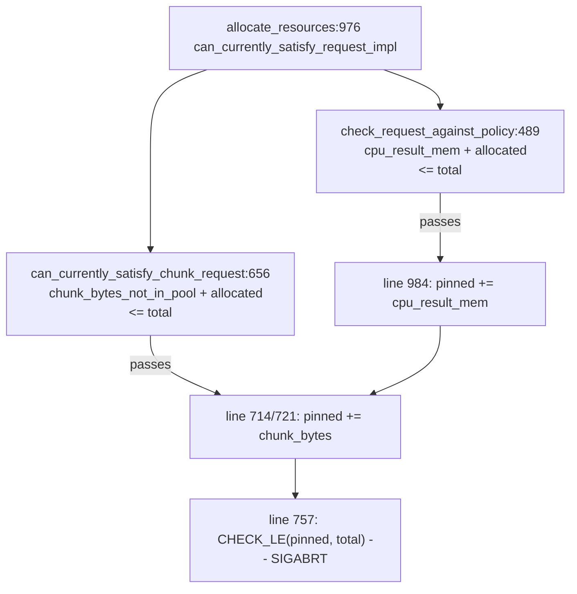

# Fix shared CPU buffer pool accounting between result memory and pinned chunks

## Root cause (re-verified against this checkout; all cited line numbers match)

With `use-cpu-mem-pool-for-output-buffers=true` (the default, `g_use_cpu_mem_pool_for_output_buffers{true}` at [QueryEngine/Execute.cpp](QueryEngine/Execute.cpp):183), [ExecutorResourceMgr.cpp](QueryEngine/ExecutorResourceMgr/ExecutorResourceMgr.cpp):725-730 maps CPU result memory onto `ResourceSubtype::PINNED_CPU_BUFFER_POOL_MEM` — the same counter slot used for pinned input chunks. Inside a single `allocate_resources` call, under one write lock, two independent pre-flight checks validate each contributor against the same pool total, and then both are committed additively into that one counter.



Neither check includes the other's contribution, so the assertion fires exactly when `allocated + cpu_result_mem + chunk_bytes > total` while each term individually fits. No concurrency, no accounting drift, and no gated/non-gated mismatch is required.

The same defect has a **second abort site** the previous plan did not identify: the gated (`buffer_mem_gated_per_slot`) branch at [ExecutorResourcePool.cpp](QueryEngine/ExecutorResourceMgr/ExecutorResourcePool.cpp):667-670 asserts `get_total_allocated_buffer_pool_mem_for_level(...) + buffer_mem_for_given_slots <= total` *after* line 984 has already folded result memory into that same total. The gated `remaining_buffer_mem_for_memory_level` computed at [ExecutorResourcePool.cpp](QueryEngine/ExecutorResourceMgr/ExecutorResourcePool.cpp):934-941 likewise ignores the result memory the same grant is about to commit.

### Corroboration from the reported values

- The two reported assertion values, 508,474,188,976 and 480,634,599,024 bytes, both exceed the executor pool reserve of 459,024,629,760 bytes.
- The larger value also exceeds the hard ceiling of the whole CPU buffer pool (483,183,820,800 bytes), so the counter provably is not tracking resident pinned chunks alone — it is an aggregate of two independently capped quantities.
- Four of the five occurrences logged zero allocation attempts, consistent with an abort during admission rather than during allocation.

## Corrections to the previous plan's analysis

These three points change what the fix has to do, so they are worth stating explicitly.

**1. The `0.8 x remaining = 342.00 GiB` decomposition is mechanically unreachable.** `min_resource_grant.cpu_result_mem` is assigned the *full* request at [ExecutorResourcePool.cpp](QueryEngine/ExecutorResourceMgr/ExecutorResourcePool.cpp):429, and `max_resource_grant.cpu_result_mem` equals the full request whenever the request is under the per-request cap (otherwise line 341 or 522 throws). So min always equals max, and `determine_dynamic_single_resource_grant`'s `std::max(min_resource_requested, ...)` at [ExecutorResourcePool.cpp](QueryEngine/ExecutorResourceMgr/ExecutorResourcePool.cpp):876-879 always returns the full request. **The `max_available_resource_use_ratio` backoff never applies to CPU result memory at all.** Granted result memory is always exactly what was asked for. The exact result-memory/chunk split of the reported values cannot be recovered from the supplied logs and should not be asserted.

**2. Therefore the auto-shrink retry is load-bearing, not a secondary cleanup.** Since nothing else can reduce result memory, the only mechanism that resizes an over-large request is the retry at [ExecutorResourceMgr.cpp](QueryEngine/ExecutorResourceMgr/ExecutorResourceMgr.cpp):120-170. It sizes slots as `cpu_buffer_pool_size_bytes / actual_buf_size_per_slot` — i.e. it targets **100% of the pool** for result memory alone, reserving nothing for chunks and ignoring current occupancy. Any non-zero chunk working set then guarantees the overrun. The existing tests pass only because at kilobyte-scale buffer sizes the `heavyai::get_page_size()` rounding leaves large slack; at realistic per-slot buffer sizes that slack nearly vanishes.

**3. The policy-overwrite bug is confirmed, and three existing tests encode it.** [ExecutorResourceMgr.cpp](QueryEngine/ExecutorResourceMgr/ExecutorResourceMgr.cpp):760-776 puts the result-memory policy and the pinned-pool policy in the same vector targeting the same subtype; `init` at [ExecutorResourcePool.cpp](QueryEngine/ExecutorResourceMgr/ExecutorResourcePool.cpp):70-80 assigns by plain overwrite in vector order, so the later pinned-pool ratio wins. In production that ratio is hardcoded to `1.0` ([Execute.cpp](QueryEngine/Execute.cpp):5493), discarding the configured `per_query_max_cpu_result_mem_ratio` of 0.8. Proof in-tree: [Tests/ExecutorResourceMgrTest.cpp](Tests/ExecutorResourceMgrTest.cpp):1195 asserts a per-query limit of `48.0 KB` for a 65536-byte pool, which is `0.75 x 65536` (the test's pinned ratio), not `0.8 x 65536`. Same at line 1253 (`750 bytes` = `0.75 x 1000`) and line 1319 (`96.0 KB` = `0.75 x 131072`).

**4. Resolving the question the previous plan left open for an owner.** Line 429 should be left as-is for now. Changing it to `request_info.min_cpu_result_mem` would let the dynamic grant scale result memory independently of `cpu_slots`, but the executor sizes per-slot output buffers from the granted slot count, so a result-memory reservation unmoored from the slot count is incoherent. The correct structural answer is to make CPU result memory a slot-dependent resource (see Out of scope) — not to change line 429 in isolation.

## Approach

### 1. Make pool-backed result memory a first-class subtype

In [ExecutorResourceMgrCommon.h](QueryEngine/ExecutorResourceMgr/ExecutorResourceMgrCommon.h), append an enumerator so indices 0-7 stay stable:

```cpp
enum class ResourceSubtype {
  // ... existing 0-7 unchanged ...
  CPU_RESULT_MEM_IN_POOL = 8,
  INVALID_SUBTYPE = 9,
  NUM_RESOURCE_SUBTYPES = 9,
};
```

Then in [ExecutorResourcePool.h](QueryEngine/ExecutorResourceMgr/ExecutorResourcePool.h): `map_resource_subtype_to_resource_type(CPU_RESULT_MEM_IN_POOL)` returns `ResourceType::CPU_BUFFER_POOL_MEM`, and `map_resource_type_to_resource_subtypes(CPU_BUFFER_POOL_MEM)` returns `{PINNED_CPU_BUFFER_POOL_MEM, PAGEABLE_CPU_BUFFER_POOL_MEM, CPU_RESULT_MEM_IN_POOL}`. Set `cpu_result_mem_resource_type` in `generate_executor_resource_mgr` to `{ResourceType::CPU_BUFFER_POOL_MEM, ResourceSubtype::CPU_RESULT_MEM_IN_POOL}`.

Because `get_allocated_resource_of_type` sums over that list ([ExecutorResourcePool.cpp](QueryEngine/ExecutorResourceMgr/ExecutorResourcePool.cpp):160-168), type-level totals keep including result memory while the two quantities become separately observable. This also dissolves the policy collision for free: the result-memory policy lands in slot 8 and the pinned-chunk policy in slot 4.

### 2. Fix the subtype/type index confusion

[ExecutorResourcePool.cpp](QueryEngine/ExecutorResourceMgr/ExecutorResourcePool.cpp):984-985 and :1055-1056 index the per-*subtype* array `allocated_resources_` with `cpu_result_mem_resource_type_.resource_type`. This works today only because the first five enumerators of both enums coincide; with the new subtype it must be `.resource_subtype`. Leave genuine type-level uses (`get_allocated_resource_of_type`, `get_total_resource`, concurrency policies, outstanding-request counters) alone.

### 3. Reserve chunk headroom inside the per-request result-memory cap

Add one private helper in `ExecutorResourcePool` and use it at both existing throw sites, so no new exception type or new throw site is needed and the error message is automatically correct:

```cpp
size_t ExecutorResourcePool::get_max_cpu_result_mem_grant_per_request(
    const size_t chunk_headroom_bytes) const {
  const size_t cap =
      get_max_resource_grant_per_request(cpu_result_mem_resource_type_.resource_subtype);
  if (cpu_result_mem_resource_type_.resource_type != ResourceType::CPU_BUFFER_POOL_MEM) {
    return cap;  // result mem has its own pool; no headroom needed
  }
  return cap > chunk_headroom_bytes ? cap - chunk_headroom_bytes : size_t(0);
}
```

`chunk_headroom_bytes` is `0` for a GPU chunk request, `chunk_request_info.total_bytes` for a non-gated CPU request, and `max_bytes_per_kernel * min_cpu_slots` (gated) — the full `total_bytes` would be far too conservative in the gated case, where only a slot's worth is pinned at a time.

Apply at:
- `calc_min_max_resource_grants_for_request` lines 337-346. **Move this block to after the chunk-gating block (after line 425)** so `buffer_mem_gated_per_slot` and `buffer_mem_per_slot` are already known. The reorder is safe: lines 350-425 read `max_resource_grant.cpu_slots`, `request_info.min_cpu_slots` and chunk info, never `cpu_result_mem`.
- `can_currently_satisfy_request_impl` lines 522-529 — this is the throw that actually fires for an over-large request, since `min_resource_grant.cpu_result_mem` is the full request.

Both sites already throw `QueryNeedsTooMuchCpuResultMem`, which is what triggers the auto-shrink retry, so this change makes the retry fire with the right target instead of after the fact.

### 4. Enforce the joint constraint in the dynamic (pool-state) checks

In `can_currently_satisfy_chunk_request` ([ExecutorResourcePool.cpp](QueryEngine/ExecutorResourceMgr/ExecutorResourcePool.cpp):622-658), include the result memory this same grant will commit, in **both** branches:

```cpp
const size_t result_mem_from_pool =
    (cpu_result_mem_resource_type_.resource_type == ResourceType::CPU_BUFFER_POOL_MEM &&
     chunk_request_info.device_memory_pool_type == ExecutorDeviceType::CPU)
        ? min_resource_grant.cpu_result_mem
        : size_t(0);

// gated branch (replaces line 645-646)
return allocated_buffer_mem_for_memory_level + result_mem_from_pool +
       min_buffer_pool_mem_required <= total_buffer_mem_for_memory_level;

// non-gated branch (replaces line 656-657)
return chunk_bytes_not_in_pool + result_mem_from_pool +
       allocated_buffer_mem_for_memory_level <= total_buffer_mem_for_memory_level;
```

Keying off `.resource_type` rather than the new subtype keeps this correct independently of step 1. Because `can_currently_satisfy_request_impl` is used both by `determine_dynamic_resource_grant` (admission) and by `allocate_resources` (pre-commit, same lock), one edit closes the hole at both call sites.

Also subtract the grant's own result memory from `remaining_buffer_mem_for_memory_level` in the gated branch of `determine_dynamic_resource_grant` ([ExecutorResourcePool.cpp](QueryEngine/ExecutorResourceMgr/ExecutorResourcePool.cpp):934-941), so `max_grantable_mem` cannot be sized against memory the same grant is about to take.

### 5. Fix the auto-shrink retry to target the capped headroom

This step is **mandatory and must land with step 1**, not after it. Restoring the 0.8 cap without it would make the retry recompute the same slot count, hit the `adjusted_cpu_slots == request_info.cpu_slots` guard at [ExecutorResourceMgr.cpp](QueryEngine/ExecutorResourceMgr/ExecutorResourceMgr.cpp):145-150, and turn a currently-succeeding query into a hard `std::runtime_error`.

Replace [ExecutorResourceMgr.cpp](QueryEngine/ExecutorResourceMgr/ExecutorResourceMgr.cpp):135-136:

```cpp
const auto adjusted_cpu_slots = cpu_buffer_pool_size_bytes / actual_buf_size_per_slot;
```

with a slot count derived from the pool's own effective per-request cap minus chunk headroom. This needs a public accessor: expose `get_max_resource_grant_per_request(ResourceSubtype)` (currently private at [ExecutorResourcePool.h](QueryEngine/ExecutorResourceMgr/ExecutorResourcePool.h):473) or add a dedicated `get_max_cpu_result_mem_per_request(chunk_headroom)` plus an `ExecutorResourceMgr` passthrough, so the manager and the pool agree on the target by construction rather than by duplicated arithmetic. The existing `adjusted_cpu_slots <= 0` guard then converts the genuinely impossible case into the clean `std::runtime_error` it already produces.

### 6. Make the abort sites unreachable, and make any throw survivable

With step 4 in place, `allocate_resources` already performs a complete joint pre-flight at lines 976-978 **before any mutation**, so no restructuring of `add_chunk_requests_to_allocated_pool` is required — which is a simplification over the previous plan, and avoids the partial-mutation leak it was designed to work around. Specifically:

- Non-gated: pre-flight guarantees `chunk_bytes_not_in_pool + cpu_result_mem + allocated <= total`; the loop at lines 711-727 adds *at most* `chunk_bytes_not_in_pool`. So line 757 is unreachable.
- Gated: pre-flight guarantees `allocated + cpu_result_mem + buffer_mem_for_given_slots <= total`, which is exactly what line 667 asserts after line 984 commits. Unreachable.

Remaining work here:

- Replace `CHECK(can_satisfy_request)` at line 978 with a thrown `ExecutorResourceMgrError`. This is the check-then-commit guard; nothing has been mutated at that point. Its message must **not** contain the substring `"CPU result memory"`, or `request_resources` will attempt another auto-shrink on it.
- Wrap the `allocate_resources` call in `process_queue_loop` ([ExecutorResourceMgr.cpp](QueryEngine/ExecutorResourceMgr/ExecutorResourceMgr.cpp):442-446) in a `try`/`catch` routing to the existing `mark_request_error(chosen_request_id, ...)`, mirroring the `choose_next_request` handling at lines 421-427. Without this, any throw escapes the resource manager's own `std::thread` and hits `std::terminate`. **The `wake_request_by_id(chosen_request_id)` call at line 447 must still run on the error path**, or the waiting query thread blocks forever. The existing recovery path is then exercised: the waiting thread sees `request_stats.error`, throws, and `handle_resource_stat_error` removes the request from the `EXECUTING` stage.
- Keep the post-commit `CHECK_LE` at line 757 as a now-provable invariant, but change it to compare the type-level allocation (`get_total_allocated_buffer_pool_mem_for_level`) rather than the pinned subtype alone, since that is the real invariant once result memory lives in its own subtype.

### 7. Collateral correctness fixes in the same module

- **`ResourceSubtypeStrings` is misordered.** Indices 5 and 6 are swapped relative to the enum ([ExecutorResourceMgrCommon.h](QueryEngine/ExecutorResourceMgr/ExecutorResourceMgrCommon.h):139-158), so pageable CPU memory logs as `pinned_gpu_buffer_pool_mem` and vice versa. This feeds `ResourceGrantPolicy::to_string()` ([ResourceGrantPolicy.cpp](QueryEngine/ExecutorResourceMgr/ResourceGrantPolicy.cpp):54), which `log_parameters()` prints at startup — so operator-facing startup logs describing per-request CPU grant caps are mislabeled as GPU. Replace the array with a `switch` so it cannot drift, and add the new subtype.
- **Guard against future slot collisions.** In `ExecutorResourcePool::init` ([ExecutorResourcePool.cpp](QueryEngine/ExecutorResourceMgr/ExecutorResourcePool.cpp):70-80), `CHECK` that no two supplied policies target the same subtype before assigning. A startup `CHECK` is right here: this is a programming error, not a runtime condition.
- **Replace the fragile string match.** `e.getErrorMsg().find("CPU result memory")` at [ExecutorResourceMgr.cpp](QueryEngine/ExecutorResourceMgr/ExecutorResourceMgr.cpp):118-119 should become a typed error kind carried on `ExecutorResourceMgrError`, since exceptions are stringified at lines 50-53. This becomes materially more important once step 6 adds a second throw out of the allocation path.
- **Double-counted outstanding request counter.** When pool-backed, `cpu_result_mem_resource_type_.resource_type` is `CPU_BUFFER_POOL_MEM`, so `allocate_resources` increments `outstanding_per_resource_num_requests_[CPU_BUFFER_POOL_MEM]` twice for one request (lines 997-1002 and 1003-1008). It is symmetric with `deallocate_resources`, so it is not a leak, but it inflates `ResourcePoolInfo::outstanding_cpu_buffer_pool_mem_requests`, which is surfaced through the executor-stats system table via [InternalExecutorStatsDataWrapper.cpp](DataMgr/ForeignStorage/InternalExecutorStatsDataWrapper.cpp).
- **`ResourcePoolInfo` reporting.** `allocated_cpu_result_mem` currently reports `get_allocated_resource_of_type(CPU_BUFFER_POOL_MEM)` — the whole pool allocation — when pool-backed. With the new subtype it should report `get_allocated_resource_of_subtype(CPU_RESULT_MEM_IN_POOL)` for a truthful value. Check the `EnableCPUBufferPool` test's expectations when changing this.
- **Dead code.** `get_requested_chunks_not_in_pool` ([ExecutorResourcePool.cpp](QueryEngine/ExecutorResourceMgr/ExecutorResourcePool.cpp):584) has no callers; remove it or leave it, but do not let it drift from `get_chunk_bytes_not_in_pool`.

## Tests

The pool-backed path combining result memory with a chunk request is uncovered today: `gen_resource_mgr_with_defaults` defaults `enable_cpu_buffer_pool` to `false` ([Tests/ExecutorResourceMgrTest.cpp](Tests/ExecutorResourceMgrTest.cpp):56-57), `default_chunk_request_info` is empty (line 41), and the one test that passes `true` (`EnableCPUBufferPool`, line 1091) uses that empty chunk info. That gap is why this shipped.

Existing tests that must be updated, because they assert the buggy cap:
- `AdjustNumCPUSlotForCPUGroupbyQuery` (line 1195), `AdjustedNumCPUSlotBecomeZero` (line 1253), `IdentitalAdjustedNumCPUSlot` (line 1319). Their expected messages change twice over: once from the 0.75 pinned ratio to the 0.8 result-mem ratio, and again from the chunk-headroom subtraction in step 3.

New tests to add:
- **Field regression case:** pool-backed manager, a single request whose result memory and chunk working set each fit under the pool but jointly do not. Must not abort; must either auto-shrink and succeed or throw a catchable error.
- **Same case in the gated path** (`bytes_scales_per_kernel = true`), covering the line 667 abort site.
- **Invariant assertion:** across a mix of concurrent pool-backed requests, `get_allocated_resource_of_type(CPU_BUFFER_POOL_MEM)` never exceeds the total.
- **Policy cap honored:** with `per_query_max_cpu_result_mem_ratio` of 0.8 and pool-backed buffers, the per-request cap derives from 0.8, not from the pinned ratio. Directly covers the overwrite bug.
- **Auto-shrink reserves chunk headroom:** the adjusted slot count accounts for both chunk bytes and the per-query cap, and the retried request is admitted.
- **Allocation-path throw is survivable:** force the `allocate_resources` pre-commit throw and assert the waiting thread receives an exception (not a hang, not `std::terminate`) and that pool accounting is unchanged afterwards.
- **Subtype/string round-trip** over all enumerators, locking down the ordering fix.

## Behavior changes and risks

- Restoring the 0.8 result-memory cap is a real behavior change: queries that previously received up to 100% of the pool are now capped and will auto-shrink to more slots' worth of smaller buffers, or fail with a clear error instead of crashing the server. This is the configured and documented intent (and what the startup log already claims), but it belongs in release notes.
- Adding a subtype changes `NUM_RESOURCE_SUBTYPES`. Verify every `std::array` sized by it ([ExecutorResourcePool.h](QueryEngine/ExecutorResourceMgr/ExecutorResourcePool.h):513-517) and every loop over subtypes, particularly `init_max_resource_grants_per_requests`, which will assign a default `UNLIMITED` policy to `CPU_RESULT_MEM_IN_POOL` in the non-pool-backed configuration. Confirm that slot stays zero-allocated there.
- Subtracting chunk headroom from the per-request result-memory cap makes admission stricter. A query with a very large chunk working set and `output_buffers_reusable_intra_thread == false` (so no auto-shrink is possible) will now be rejected where it previously crashed the server — correct, but a user-visible change from "server restart" to "query error".
- The throw added at [ExecutorResourcePool.cpp](QueryEngine/ExecutorResourceMgr/ExecutorResourcePool.cpp):978 is on the resource manager's queue thread. Step 6's `try`/`catch` and the preserved `wake_request_by_id` are not optional.

## Out of scope

- **The structural follow-up.** CPU result memory should be modeled as a resource *dependent on* `cpu_slots`, using the `calc_max_dependent_resource_grant_for_request` / `buffer_mem_gated_per_slot` machinery that already exists for pageable chunk memory. Today the pool grants `cpu_slots` and `cpu_result_mem` independently, so with `output_buffers_reusable_intra_thread` it reserves `per_slot x requested_slots` while only granting `granted_slots` — a systematic over-reservation, and the reason an exception-driven, string-matched retry outside the lock exists at the manager level at all. Doing this properly would let the pool scale slots to fit under the lock and would make the retry in `request_resources` unnecessary. It also subsumes the `min_resource_grant.cpu_result_mem` question at line 429. Materially larger blast radius; should be its own change.
- The other fatal signatures in the reported incident (a GPU illegal-address fault, a `StringDictionary` bounds check with an out-of-range id, a SIGSEGV, and a `RelAlgOptimizer` check) have independent causes and need separate investigation. This plan addresses only the `ExecutorResourcePool` aborts.
- Latent `CHECK`s elsewhere in the same file that are currently proven safe by callers but remain abort-on-release (for example lines 644 and 651) are left alone; converting them is a broader hardening pass.
