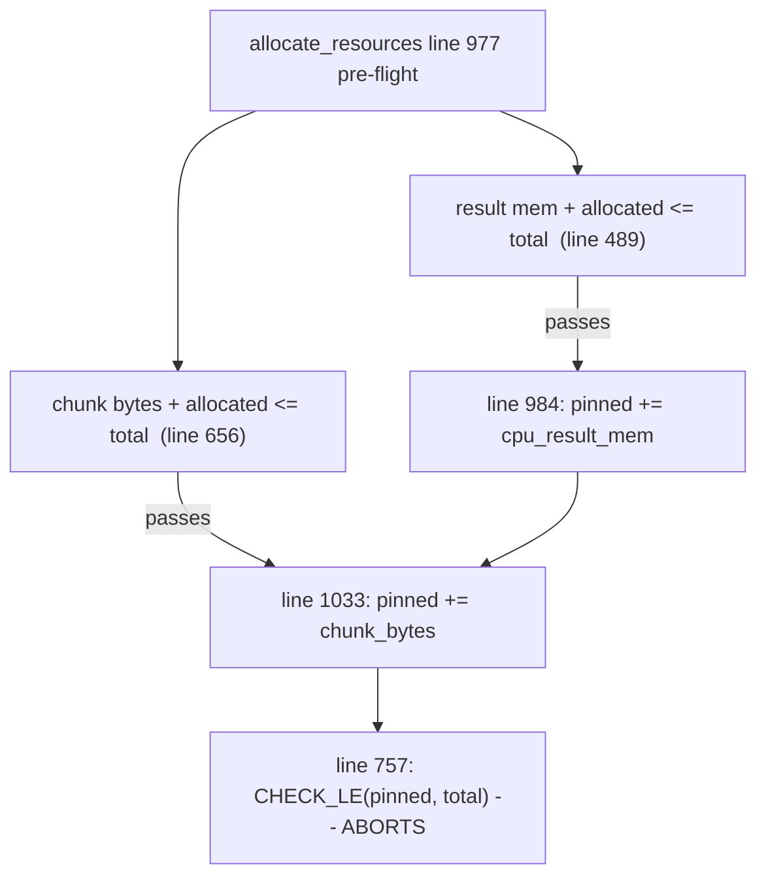

# Fix shared CPU buffer pool accounting between result memory and pinned chunks

## Root cause

When `use-cpu-mem-pool-for-output-buffers=true` (the default), [QueryEngine/ExecutorResourceMgr/ExecutorResourceMgr.cpp](QueryEngine/ExecutorResourceMgr/ExecutorResourceMgr.cpp):725-729 maps CPU result memory onto `ResourceSubtype::PINNED_CPU_BUFFER_POOL_MEM` - the same slot used for pinned input chunks. Two independent pre-flight checks then validate each contributor separately against the same pool total, and both are committed additively, so their sum can exceed the pool.



Observed in the field: a 342.00 GiB result-memory grant plus a 131.55 GiB chunk working set = 473.55 GiB committed against a 427.50 GiB pool. Each term individually fits; the sum does not.

A second defect compounds it: [ExecutorResourceMgr.cpp](QueryEngine/ExecutorResourceMgr/ExecutorResourceMgr.cpp):760-769 generates two per-request grant policies targeting that same subtype slot, and `init` at [ExecutorResourcePool.cpp](QueryEngine/ExecutorResourceMgr/ExecutorResourcePool.cpp):71-79 assigns by plain overwrite, so the operator's `per_query_max_cpu_result_mem_ratio` (0.8) is silently replaced by the hardcoded pinned-pool ratio of 1.0.

## Approach

### 1. Make pool-backed result memory a first-class subtype

In [ExecutorResourceMgrCommon.h](QueryEngine/ExecutorResourceMgr/ExecutorResourceMgrCommon.h), add a new enumerator after the existing ones so indices 0-7 stay stable:

```cpp
enum class ResourceSubtype {
  // ... existing 0-7 unchanged ...
  CPU_RESULT_MEM_IN_POOL = 8,
  INVALID_SUBTYPE = 9,
  NUM_RESOURCE_SUBTYPES = 9,
};
```

Then in [ExecutorResourcePool.h](QueryEngine/ExecutorResourceMgr/ExecutorResourcePool.h):
- `map_resource_subtype_to_resource_type(CPU_RESULT_MEM_IN_POOL)` returns `ResourceType::CPU_BUFFER_POOL_MEM`.
- `map_resource_type_to_resource_subtypes(CPU_BUFFER_POOL_MEM)` returns `{PINNED_CPU_BUFFER_POOL_MEM, PAGEABLE_CPU_BUFFER_POOL_MEM, CPU_RESULT_MEM_IN_POOL}`.

Because `get_allocated_resource_of_type` sums over that list ([ExecutorResourcePool.cpp](QueryEngine/ExecutorResourceMgr/ExecutorResourcePool.cpp):160-168), type-level totals keep including result memory, while the two quantities become separately observable. Update `cpu_result_mem_resource_type_` in `generate_executor_resource_mgr` to `{ResourceType::CPU_BUFFER_POOL_MEM, ResourceSubtype::CPU_RESULT_MEM_IN_POOL}`.

This alone removes the policy collision: the result-mem policy lands in slot 8 and the pinned-chunk policy in slot 4, so the configured 0.8 ratio is honored again.

### 2. Fix the subtype/type index confusion

`allocate_resources` line 984-985 and `deallocate_resources` line 1056 index the per-*subtype* array `allocated_resources_` with `cpu_result_mem_resource_type_.resource_type`. This currently works only because the first four enumerators of both enums coincide. With the new subtype it must be `.resource_subtype`. Leave the genuine type-level uses (`get_allocated_resource_of_type`, `get_total_resource`, concurrency policies) alone.

### 3. Enforce the joint constraint in pre-flight

In `can_currently_satisfy_chunk_request` ([ExecutorResourcePool.cpp](QueryEngine/ExecutorResourceMgr/ExecutorResourcePool.cpp):622-658), include the result memory this same grant will commit, in **both** the gated and non-gated branches:

```cpp
const size_t result_mem_from_pool =
    (cpu_result_mem_resource_type_.resource_subtype ==
         ResourceSubtype::CPU_RESULT_MEM_IN_POOL &&
     chunk_request_info.device_memory_pool_type == ExecutorDeviceType::CPU)
        ? resource_grant.cpu_result_mem
        : size_t(0);

// non-gated
return chunk_bytes_not_in_pool + result_mem_from_pool +
           allocated_buffer_mem_for_memory_level <= total_buffer_mem_for_memory_level;
```

This single change closes the hole at both call sites, since `can_currently_satisfy_request_impl` is used by `determine_dynamic_resource_grant` (admission) and by `allocate_resources` (sanity check under the same lock).

### 4. Handle the "can never fit" case, and auto-shrink the rest

Note that `min_resource_grant.cpu_result_mem` is assigned `request_info.cpu_result_mem` - the *full* request, not `min_cpu_result_mem` ([ExecutorResourcePool.cpp](QueryEngine/ExecutorResourceMgr/ExecutorResourcePool.cpp):429). Consequently `determine_dynamic_single_resource_grant` can never scale result memory down. So the remedy is not grant scaling but:

**(a) Reject cleanly when impossible.** In `calc_min_max_resource_grants_for_request`, after the existing buffer-pool checks, throw `QueryNeedsTooMuchCpuResultMem` when `request_info.cpu_result_mem + chunk_request_info.total_bytes` exceeds the CPU pool total for the pool-backed case. Throwing this specific type matters because it is what triggers the auto-shrink retry.

**(b) Shrink slots so the query still runs.** The retry at [ExecutorResourceMgr.cpp](QueryEngine/ExecutorResourceMgr/ExecutorResourceMgr.cpp):120-169 currently sizes slots against the entire pool and reserves nothing for chunks:

```cpp
const auto adjusted_cpu_slots = cpu_buffer_pool_size_bytes / actual_buf_size_per_slot;
```

Change it to subtract the chunk working set and apply the per-query result-mem cap:

```cpp
const auto chunk_bytes =
    request_info.chunk_request_info.device_memory_pool_type == ExecutorDeviceType::CPU
        ? request_info.chunk_request_info.total_bytes
        : size_t(0);
const auto available_for_result_mem =
    cpu_buffer_pool_size_bytes > chunk_bytes ? cpu_buffer_pool_size_bytes - chunk_bytes
                                             : size_t(0);
const auto adjusted_cpu_slots = available_for_result_mem / actual_buf_size_per_slot;
```

The existing guards (`adjusted_cpu_slots <= 0` and `adjusted_cpu_slots == request_info.cpu_slots`) already convert the impossible case into a clean `std::runtime_error` and prevent unbounded recursion.

### 5. Make the assertion unreachable and the error path safe

Even with the above, the abort site should not be able to kill the server:

- Restructure `add_chunk_requests_to_allocated_pool` ([ExecutorResourcePool.cpp](QueryEngine/ExecutorResourceMgr/ExecutorResourcePool.cpp):660-758) as check-then-commit: compute the delta via the existing `get_chunk_bytes_not_in_pool` first, validate, and only then mutate the chunk map and counter. Throwing part-way through the current loop would leave pinned bytes leaked with no grant for the caller to release.
- Keep a defensive check after commit, but compare the full type-level allocation (`get_total_allocated_buffer_pool_mem_for_level`) rather than the pinned subtype alone, since that is the real invariant.
- Wrap the `allocate_resources` call in `process_queue_loop` ([ExecutorResourceMgr.cpp](QueryEngine/ExecutorResourceMgr/ExecutorResourceMgr.cpp):443) in a try/catch that routes to the existing `mark_request_error(chosen_request_id, ...)`, mirroring the handling of `choose_next_request` at lines 421-427. Without this, any throw escapes the resource manager's own `std::thread` and calls `std::terminate`.

### 6. Collateral correctness fixes

- **`ResourceSubtypeStrings` is misordered.** Indices 5 and 6 are swapped relative to the enum ([ExecutorResourceMgrCommon.h](QueryEngine/ExecutorResourceMgr/ExecutorResourceMgrCommon.h):150-158), so pageable CPU memory logs as `pinned_gpu_buffer_pool_mem`. This feeds `ResourceGrantPolicy::to_string()` and the startup `log_parameters()` dump. Replace the array with a `switch` so it cannot drift, and add the new subtype.
- **Guard against future slot collisions.** In `ExecutorResourcePool::init` ([ExecutorResourcePool.cpp](QueryEngine/ExecutorResourceMgr/ExecutorResourcePool.cpp):71-79), `CHECK` that no two supplied policies target the same subtype before assigning. A startup `CHECK` is appropriate here since this is a programming error, not a runtime condition.
- **Decide on `min_resource_grant.cpu_result_mem`.** Line 429 assigning the full request rather than `request_info.min_cpu_result_mem` looks unintentional and defeats dynamic scaling. Flag for owner review rather than changing silently; it widens the fix if changed.
- Replace the fragile `e.getErrorMsg().find("CPU result memory")` string match at [ExecutorResourceMgr.cpp](QueryEngine/ExecutorResourceMgr/ExecutorResourceMgr.cpp):118-119 with a typed error kind carried on `ExecutorResourceMgrError`, since exceptions are stringified at lines 50-53.

## Tests

The pool-backed path is essentially uncovered today: `gen_resource_mgr_with_defaults` defaults `enable_cpu_buffer_pool` to `false` ([Tests/ExecutorResourceMgrTest.cpp](Tests/ExecutorResourceMgrTest.cpp):57), only one test passes `true`, and `default_chunk_request_info` is empty - so no existing test combines result memory with a chunk request. Add to that file:

- **Field regression case:** pool-backed manager, one request whose result memory is ~0.8 of the pool and whose chunk set is ~0.3 of the pool. Must not abort; must either shrink slots and succeed or throw a catchable error.
- **Joint constraint:** two quantities that each fit but do not fit together are rejected or scaled, and `get_allocated_resource_of_type(CPU_BUFFER_POOL_MEM)` never exceeds the total.
- **Policy cap honored:** with `per_query_max_cpu_result_mem_ratio` of 0.8 and pool-backed buffers, the per-request cap is 0.8 of the pool, not 1.0. This directly covers the overwrite bug.
- **Auto-shrink reserves chunk headroom:** adjusted slot count accounts for chunk bytes.
- **Subtype/string round-trip** over all enumerators, to lock down the ordering fix.

## Behavior changes and risks

- Restoring the 0.8 result-memory cap is a real behavior change: queries that previously received up to 100% of the pool will now be capped and may auto-shrink to more CPU slots' worth of smaller buffers, or fail with a clear error instead of crashing the server. This is the configured intent, but it should be called out in release notes.
- Adding a subtype changes `NUM_RESOURCE_SUBTYPES`; verify every `std::array` sized by it and every loop over subtypes, particularly `init_max_resource_grants_per_requests`, which will now assign a default UNLIMITED policy to `CPU_RESULT_MEM_IN_POOL` when not pool-backed. Confirm that slot stays zero-allocated in the non-pool configuration.
- `ResourcePoolInfo` and any system-table or `/memory` introspection surfacing allocated CPU buffer pool memory should be checked so the new subtype is reported coherently.

## Out of scope

The reported incident involved eleven restarts from at least five distinct causes. This plan addresses only the five `ExecutorResourcePool` aborts. The `CUDA_ERROR_ILLEGAL_ADDRESS` failures, the `StringDictionary` bounds check with an evidently corrupt id (`2147478150 < 75`), the SIGSEGV, and the `RelAlgOptimizer` check need separate investigation.
