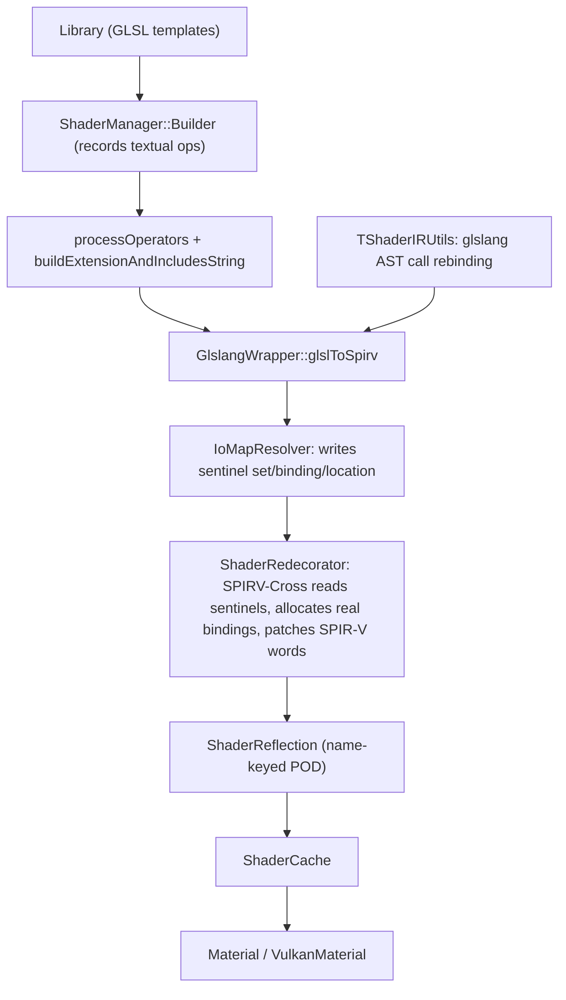

# Replacing glslang with Slang and upgrading to Vulkan 1.4

## Context

The shader pipeline assembles GLSL from templates at runtime, compiles it with glslang, then post-processes the SPIR-V to assign descriptor bindings and extract reflection:



`ShaderRedecorator` exists because glslang's I/O mapper works per-`TProgram`, and [GfxDriver/ShaderCompiler/ShaderManager.cpp](GfxDriver/ShaderCompiler/ShaderManager.cpp) calls `buildSpirv` once per stage, so glslang cannot assign bindings coherently across the stages of one material. The sentinels in [GfxDriver/ShaderCompiler/ShaderRedecorator.h](GfxDriver/ShaderCompiler/ShaderRedecorator.h) exist purely to distinguish "explicitly declared" from "needs assignment".

## The gating constraint, as resolved by PR 0a

**This section's original premise was wrong, and the correction re-sequences the plan.** It assumed the SDK was pinned at 1.3.275.0 *because* of the 15 hand-copied glslang private headers, and that PRs 3 and 4 both had to land before the SDK could move. The PR 0a spike disproved that: the tree now builds and runs correctly on SDK 1.4.363.0 with glslang 16.6.0, private headers and all. Total adaptation cost was two commits:

- `GlslangWrapper.cpp` needed `MachineIndependent/LiveTraverser.h` included ahead of `iomapper.h`, which no longer pulls in the AST types itself
- `SpirvCrossUtils.cpp` needed new `case` arms for SPIRV-Cross base types added since 1.3.275 (`CoopVecNV`, `MeshGridProperties`, `BFloat16`, `FloatE4M3`, `FloatE5M2`, `Tensor`, `DescriptorHeapBuffer`)

`FindGlslang.cmake` needed no change: the SDK still builds `MachineIndependent`, `GenericCodeGen`, and `OSDependent` as separate static libraries, so the `REQUIRED_VARS` failure the plan predicted never materialized. The "glslang changes" in the old pin comment therefore referred to something already fixed upstream, not to a standing blocker.

What this means for the rest of the plan:

- The private headers are **technical debt, not a blocker**. PRs 3 and 4 remain worth doing, because the sentinel values are derived from glslang internals and `ShaderRedecorator` is the bulk of what Slang replaces, but they no longer hold back an SDK upgrade and can be sequenced on their own merits.
- Removing the copy block from `common-functions.sh` and dropping `glslang/SPIRV/disassemble.h` becomes a cleanup pass *after* PRs 3 and 4, tracked as PR 5c, rather than a precondition for the bump.
- The bump also supplied the second thing the migration needs: `slangc` and `slang.h` are now installed in the deps prefix, so the PR 0b spike is unblocked.

For the record, the two dependencies that drive PRs 3 and 4:

- [GfxDriver/ShaderCompiler/TShaderIRUtils.cpp](GfxDriver/ShaderCompiler/TShaderIRUtils.cpp) needs `Include/InfoSink.h`, `Include/intermediate.h`, `MachineIndependent/LiveTraverser.h`, `MachineIndependent/localintermediate.h`
- [GfxDriver/ShaderCompiler/GlslangWrapper.cpp](GfxDriver/ShaderCompiler/GlslangWrapper.cpp) needs `MachineIndependent/iomapper.h` to subclass `glslang::TIoMapResolver`, which `Public/ShaderLang.h` only forward-declares, plus `Include/Types.h` transitively via `ent.symbol->getType().getQualifier()`

## The binding convention (the contract to preserve)

This is the semantic contract every PR below must keep intact. [Tests/RenderTests/ShaderCompiler/shaders/shaderRedecoratorTest.vert](Tests/RenderTests/ShaderCompiler/shaders/shaderRedecoratorTest.vert) is the canonical illustration:

```
layout(std430, binding = 0) uniform SHARED_UBO { mat4 viewTM; };   // explicit: shared across stages, keep
layout(std430) uniform VERT_UBO { float vert_x; int vert_y; };      // omitted: auto-assign, stage-local
layout(binding = 3) uniform sampler2D shared_sampler;               // explicit: shared, keep
uniform sampler2D vert_sampler;                                     // omitted: auto-assign
in vec3 in_position;                                                // no location: auto-assign
```

An explicit `binding = N` means "this resource is shared across the stages of the material, keep this number so the stages agree". An omitted binding means "allocate one for me". That distinction is the entire reason the sentinel scheme exists, and it is what `reserveBindings` (reserve the explicit ones first) and `allocateBindings` (fill the gaps) implement.

## Verified facts that shape the plan

- No shader declares an explicit `set =` anywhere, so all set-handling branches in `ShaderRedecorator` guard a case that never occurs, consistent with the hardcoded `int set = 0` in `redecorateInternal`. Only the binding distinction is real.
- Vertex attribute locations are reassigned unconditionally; the location sentinel is never tested, only the presence of a `Location` decoration matters. This makes `kUninitializedLocation` far easier to eliminate than the binding sentinel.
- The sentinel values are "one less than `glslang::TQualifier::layout*End`" per the comment in `ShaderRedecorator.h:22-29`, that is, derived from glslang's internal "undefined" markers. They are therefore inherently version-fragile. PR 0a showed the values happened to survive 1.3.275 to 16.6.0 unchanged, so this is a latent hazard rather than an active one, but nothing guarantees the next bump is as kind.
- `replaceFunctionCall` has no live callers; it is only reachable via builder deserialization at `ShaderManager.cpp:354`. The only live producer of the rebind map is `addSubroutineBinding`, keyed on bare function names
- The AST path does not support function overloads (`TShaderIRUtils.cpp:57-59`), so textual substitution gives up no capability
- Includes are resolved textually by `buildExtensionAndIncludesString` and prepended *after* `processOperators` runs, so any textual subroutine pass must be a post-assembly phase over `final_glsl`, not an `OpType`
- [GfxDriver/ShaderCompiler/ResourceLimits.cpp](GfxDriver/ShaderCompiler/ResourceLimits.cpp) is a vendored copy of glslang's `StandAlone/ResourceLimits.cpp`, so `DefaultTBuiltInResource` is already local

## Inventory

- Roughly 130 shader sources: 122 stage files (`.vert`, `.frag`, `.comp`, `.geom`, `.mesh`, `.task`, `.raygen`, `.closest`, `.isect`, and similar) plus 24 shared `.glsl` include files
- Around 108 of those declare uniform or buffer resources, totalling roughly 300 declarations. This is the sizing for PR 4's fallback approach.

## The reflection contract

`ShaderReflection` is the seam to preserve throughout; `Material` depends on it in 21 places. Any replacement backend must be able to populate all of it. The accessor surface actually consumed by [GfxDriver/Pipeline/Material.cpp](GfxDriver/Pipeline/Material.cpp) is:

- `getAllUniformBufferNames`, `getUniformBufferBinding`, `getUniformBufferBlockSize` (used to size and create local UBOs)
- `hasVertexAttr`, `getVertexAttrLocation`
- `hasUniformBufferAttr`, `getUniformBufferAttrItemInfo`, `getShaderStorageBufferAttrItemInfo`
- `getSamplerBinding` / `getSamplerArraySize`, `getStorageImageBinding` / `getStorageImageArraySize`

`ShaderManager::buildSpirv` additionally uses `getUniformBufferBinding` to validate that every name passed to `setExternalUniformBuffers` actually exists in the shader (`ShaderManager.cpp:1043-1047`), and `createCacheVector` uses `getAllUniformBufferAttrNames` / `getAllShaderStorageBufferAttrNames` with `ItemInfo` equality to reject duplicate non-shared attribute names across stages. Both checks must keep working.

`ShaderReflection` has no push-constant support; those are hand-maintained separately in [GfxDriver/Pipeline/PushConstantRanges.cpp](GfxDriver/Pipeline/PushConstantRanges.cpp).

## PR 0 - Spikes (no production code)

Two cheap experiments that decide branches below.

**0a, done.** The SDK bump, executed per [.cursor/plans/vulkan-sdk-1.4.363-fork.md](.cursor/plans/vulkan-sdk-1.4.363-fork.md) and landed rather than discarded, because it turned out to cost two small commits instead of the API-drift slog the plan budgeted for. See the gating-constraint section above for the findings and their consequences. The surviving pieces of what was PR 5 are now PR 5b and PR 5c.

**0b, next.** Compile all shader sources through `slangc`'s GLSL compatibility mode (`-allow-glsl`) and count failures. This sizes PR 6 onward and determines whether incremental adoption is viable. `slangc` now ships in the deps prefix at `$PREFIX/bin/slangc`, installed by the `slang` target added to the `install_vulkan` invocation.

The spike needs to distinguish three outcomes per file, because only the first is cheap:

- compiles clean under `-allow-glsl`
- fails on something mechanical and pattern-fixable across many files
- fails on something Slang's GLSL subset genuinely does not model, which forces that shader into the PR 8 rewrite bucket early

Note that stage files are not independently compilable: they depend on the `#include` dictionary assembled at runtime by `buildExtensionAndIncludesString`, and on the `processOperators` textual substitutions. A spike that feeds raw template sources to `slangc` will report failures that are artifacts of missing includes rather than real Slang gaps. Either run the spike over assembled `final_glsl` captured from a real run (the `ShaderArtifactTypeBits` hooks can emit it), or accept that the raw-source pass only produces a lower bound and triage accordingly.

## PR 1 - Replace byte-exact SPIR-V goldens with semantic assertions

Must land first; every later PR changes SPIR-V output.

[Tests/RenderTests/ShaderCompiler/ShaderCompilerTest.cpp](Tests/RenderTests/ShaderCompiler/ShaderCompilerTest.cpp) currently asserts:

```
    EXPECT_EQ(read_spirv, spirv_gen);
```

The README already documents regenerating goldens whenever the toolchain moves, which makes the test vacuous exactly when it is needed. Replace with assertions on full `ShaderReflection` contents (set, binding, location, offset, size, array size, keyed by name), `spirv-val` on each blob, and the existing image-comparison render tests as backstop. Extend `ShaderRedecoratorTest` and `ShaderRedecoratorClashTest`, which are already the right shape. Add a reflection-dump artifact using the existing `ShaderArtifactTypeBits::kSpvReflect` hook.

Corrected: the `.spv` goldens *are* checked in, 18 of them across `Manual/Results` and `Renderer/Results`. The earlier claim that only `Inputs/*.builder` was present was wrong.

PR 0a then produced a live demonstration of why this test needs replacing. Moving to glslang 16.6.0 required regenerating 9 of the goldens, one of which changed size (`SMAANeighborhoodBlending.frag.spv`, 6896 to 6832 bytes). A size change means codegen genuinely changed, and the test offered no way to tell whether the new output was semantically equivalent; the only available response was to accept the new bytes. That commit is the argument for this PR: cite it in review.

Tests only; no production change.

## PR 2 - Hygiene and dead code

No behaviour change; makes later diffs readable.

- `kShaderStageCount = 8` in [GfxDriver/ShaderCompiler/Types.h](GfxDriver/ShaderCompiler/Types.h) is marked "must be kept in sync with enum" but `ShaderStage` has 14 entries. Currently unreferenced, so latent.
- `find_error_line_number` in `GlslangWrapper.cpp:210-232` scrapes glslang's log format and `CHECK_NE`s on it, hard-crashing debug builds if the format changes, and reports only the first error.
- `ShaderRedecorator::getReservedBindings` ignores its `resource_type` parameter; `redecorateInternal` is always called with `set = 0`. Delete the vestigial multi-set scaffolding (including `ShaderReflection::validateSet`, which only checks `!= -1`) or document why it stays.

## PR 3 - Remove TShaderIRUtils, resolve subroutines textually

Retires 3 of the 15 private headers. Delete [GfxDriver/ShaderCompiler/TShaderIRUtils.cpp](GfxDriver/ShaderCompiler/TShaderIRUtils.cpp) and its header, and drop the `rebind_tshader_function_calls` call from `glslToSpirv`.

Implement subroutine resolution as a post-assembly textual pass over `final_glsl`, after includes are prepended. It cannot be an `OpType` because targets such as `transformRGBtoRGB` live in `colorConvertSubroutines.glsl`, which is not present during `processOperators`.

Requirements:
- Match on `name(` and handle the source function's own definition explicitly. The AST path currently relies on glslang's call-graph dead-code elimination to drop what becomes unreachable.
- `is_required` needs lexical detection of the target definition; reuse the existing `get_function_bounds` helper.
- Tolerate transient empty targets: `addSubroutineBinding("getAccumulatedColor", "", true)` at `QueryRenderer/Scales/ScaleAccumState.cpp:526` is overwritten at line 575.

Residual risk to note in review: targets reaching the shader via a literal `#include` resolved by `GlslangIncluder` rather than the include dictionary are invisible to text-time inspection.

## PR 4 - Remove IoMapResolver, drop iomapper.h

The other half of the unpin. Primary approach: link all stages of a material into a single `glslang::TProgram` and let glslang's own default resolver assign coherent cross-stage bindings. `TProgram::mapIO(nullptr, nullptr)` is public API, so no private header and no shader source churn. `TDefaultGlslIoResolver` keys its slot map by name across stages, which is exactly the sharing semantics the sentinels currently emulate.

Changes:
- Restructure `createCacheVector` and `buildSpirv` from per-stage to per-material: run `processOperators` for all builders, create all `TShader`s, add all to one `TProgram`, link and `mapIO` once, then call `GlslangToSpv` per stage intermediate (already the shape, via `program->getIntermediate(stage)`).
- Delete the `IoMapResolver` class, the three sentinel constants, and `ShaderRedecorator`'s allocation logic. `ShaderRedecorator` reduces to reflection extraction via SPIRV-Cross.
- `createCache` (single builder, explicitly does not redecorate) stays a single-stage `TProgram`.
- Preserve equivalents for `reserveBindings` clash diagnostics (covered by `ShaderRedecoratorClashTest`) and the `kMaxBindingsPerSet` overflow checks, since glslang's resolver will not produce the same messages.

Bindings will differ from today. All consumers are reflection-driven, and PR 1's tests verify this.

Fallback if the single-`TProgram` approach misbehaves: declare the sentinels explicitly in shader source behind macros (`layout(set = AUTO_SET, binding = AUTO_BINDING)`), keeping `ShaderRedecorator` byte-identical. This is mechanical but touches roughly 300 declarations across 108 files, makes every resource declaration noisier, and requires confirming glslang accepts out-of-range values as explicit source qualifiers.

Rejected alternative, recorded so nobody spends a day on it: using glslang's public `setShiftUboBinding` / `setShiftSsboBinding` / `setShiftSamplerBinding` / `setShiftImageBinding` to push auto-assigned bindings into a high range, so the auto-versus-explicit test becomes a threshold comparison instead of a sentinel match. This looks ideal because it needs no private header and no shader changes, but it does not work: `TDefaultIoResolver::resolveBinding` adds the shift base to *explicitly declared* bindings as well as auto-assigned ones, so both land in the shifted range and remain indistinguishable. The shift is an HLSL register-offset feature, not an auto-allocation base.

## PR 5a - Vulkan SDK 1.4.363.0 with Slang (done, landed early)

The dependency tree now builds `loader glslang spirvcross vul layers slang` from a fork of the upstream 1.4.363.0 script. No longer gated on PRs 3 and 4, which is the plan's main correction. Details in [.cursor/plans/vulkan-sdk-1.4.363-fork.md](.cursor/plans/vulkan-sdk-1.4.363-fork.md).

Two loose ends it deliberately left:

- Slang attribution and OSRB approval, Task 3 of that plan, still outstanding. Needed before anything ships with Slang linked in, so it gates PR 6's merge rather than its development.
- `ThirdParty/vulkan/vulkansdk-1.3.275.0` was deleted, so reverting the bump is no longer a one-line `VULKAN_VERSION` change. Revert the commit instead.

## PR 5b - Retarget to Vulkan 1.4 and SPIR-V 1.6, still on glslang

Independent of PRs 3 and 4. Now that the SDK supports it, this is the remaining version work, and it is the risk-bearing half: PR 5a changed which toolchain compiles the shaders, while this changes what the toolchain is asked to emit and what the driver advertises.

- Resolve the existing mismatch: the instance requests `VK_API_VERSION_1_3` (`GfxDriver/Drivers/Vulkan/VulkanPlatform.cpp:39`) while the compiler targets `EShTargetVulkan_1_2` / `EShTargetSpv_1_4` (`GlslangWrapper.cpp:274-275`). Align both to Vulkan 1.4 and SPIR-V 1.6.
- Adopt what 1.4 promotes out of the optional extension handling in `VulkanPlatform.cpp:59-88`.
- Normalize `GfxDriver/Drivers/Vulkan/VulkanPhysicalDevice.cpp:84-85`, where "is at least 1.2" is spelled `major > 1 || minor > 1`.

Raising the minimum Vulkan version is a deployment decision, not just a code change: it sets a driver-version floor for customers. Confirm the supported-driver matrix tolerates 1.4 before landing, and keep this PR separate from 5a so it can be reverted alone.

## PR 5c - Drop the private headers

Pure cleanup, unblocked only once PRs 3 and 4 have removed the last consumers. Tracked separately so the debt does not get forgotten now that it no longer blocks anything.

- Delete the header-copying block and the `mkdir -p` guards at `scripts/common-functions.sh:1091-1111`, and the accompanying comment at 1077-1081.
- Replace `glslang/SPIRV/disassemble.h` in [GfxDriver/ShaderCompiler/SpirvArtifacts.cpp](GfxDriver/ShaderCompiler/SpirvArtifacts.cpp) line 11 with the SPIRV-Tools disassembler. This one is already independent of PRs 3 and 4 and could ride along with either.

Verify by confirming a deps build with the block removed still produces a tree the renderer compiles against; the headers are copied into the prefix, so a stale prefix will mask the failure.

## PR 6 - Introduce a compiler backend seam, add Slang alongside glslang

Purely additive. [GfxDriver/ShaderCompiler/ShaderManager.h](GfxDriver/ShaderCompiler/ShaderManager.h) line 315 holds a concrete `GlslangWrapperUqPtr`; introduce a `ShaderCompilerBackend` interface (compile plus reflect) and add a Slang implementation selectable by flag, with glslang remaining the default. Map `GlslangIncluder` onto a Slang `ISlangFileSystem` over `Library`. Nothing changes for existing callers.

Scope depends on spike 0b. Also needs Slang OSRB approval before it can merge, carried over from PR 5a.

## PR 7 - Switch the default to Slang, delete ShaderRedecorator

Slang assigns descriptor sets and bindings across a composed program with multiple entry points and reports them through reflection, so the remaining redecoration, SPIRV-Cross patching via `get_binary_offset_for_decoration`, and `ResourceLimits` / `TBuiltInResource` all go away rather than being ported. This also resolves the never-completed TODO at `GlslangWrapper.cpp:198` about sourcing limits from the device, since limit validation moves to the driver.

Keep `ShaderReflection` unchanged and populate it from Slang reflection. Four behaviours need deliberate reimplementation:

- Clash diagnostics quality from `reserveBindings` / `allocateBindings`
- The struct-flattening naming convention at `ShaderRedecorator.cpp:306-355`: dotted names for nested UBO members, bare names for SSBO members, depended on verbatim by `Material` and the Vega property writers
- `validate_buffer_attr_type`, which whitelists only scalar int/uint/int64/uint64/float/double; decide whether to carry the restriction forward
- Push constants, currently hand-maintained in [GfxDriver/Pipeline/PushConstantRanges.cpp](GfxDriver/Pipeline/PushConstantRanges.cpp) and absent from reflection, come free here

## PR 8+ - Migrate shader sources to Slang modules and generics

Largest effort, biggest long-term payoff, safely deferrable. Slang interfaces plus generics with link-time specialization replace both the subroutine mechanism from PR 3 and the string-splicing `Builder` itself, which is the root source of the complexity this subsystem exists to manage. Migrate per-shader or per-family behind the PR 6 flag rather than as a flag day.

## Open risks

- Whether glslang's default GLSL I/O resolver assigns bindings coherently across stages in a single `TProgram` while respecting explicit bindings. Gates PR 4's primary approach; the fallback is documented above.
- How many of the ~130 shader sources clear Slang's GLSL subset. Gates PR 6 onward, and is what spike 0b measures.
- Slang OSRB approval. Not a technical risk but a hard gate on shipping anything from PR 6 onward, and entirely outside this plan's control, so start it now rather than when the code is ready.

Retired: the SDK bump itself, which PR 0a landed.

PRs 1 through 3 are worth doing regardless of how spike 0b resolves.
