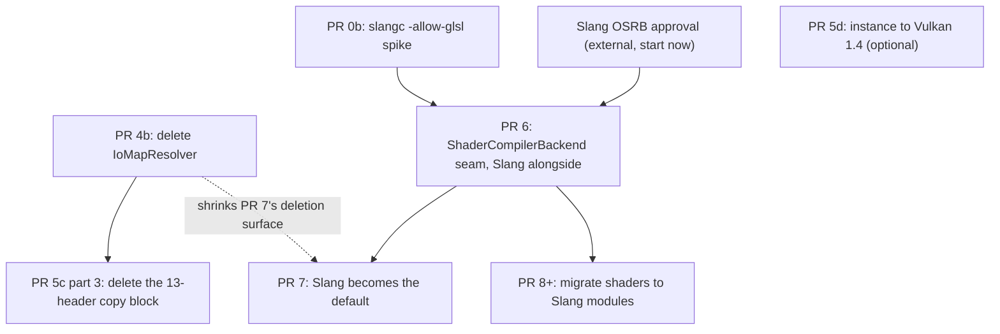

# Remaining work: replacing glslang with Slang

Companion to [.cursor/plans/glslang-to-slang-migration.md](.cursor/plans/glslang-to-slang-migration.md), which keeps the full history and the reasoning behind decisions already taken. This file covers only what is left.

## What has already landed

- **PR 0a** - Spiked and kept the SDK bump. The tree builds and runs on Vulkan SDK 1.4.363.0 with glslang 16.6.0. This disproved the plan's central premise: the private headers were never what pinned the SDK, so PRs 3 and 4 do not gate anything except their own cleanup.
- **PR 1** (`95fb438ec0`) - Replaced byte-exact SPIR-V goldens with `ShaderReflection` text goldens plus `spirv-val`. Nine `.reflect` files. This is the safety net every remaining PR is verified against.
- **PR 2** (`34eed87b9a`) - Hygiene: deleted `kShaderStageCount`, hardened glslang error-log scraping, collapsed the vestigial multi-set scaffolding, restored the rule of zero on `ShaderReflection`.
- **PR 5a** - Vulkan SDK 1.4.363.0 with Slang built alongside glslang. `slangc` and `slang.h` are now in the deps prefix.
- **PR 5b** (`4752a50653`) - Retargeted the compiler to Vulkan 1.3 / SPIR-V 1.6, split `VULKAN_API_VERSION` into instance and device-minimum constants, fixed a `VulkanPhysicalDevice` gate that tested 1.2 while chaining 1.3 structs.
- **PR 5c parts 1 and 2** (`d4019d84e6`) - Deleted the dead `build_info.h` include and swapped glslang's disassembler for the SPIRV-Tools one. The copy block in `scripts/common-functions.sh` is down from 16 files to 14.
- **PR 3** (`9b8be38b08`) - Deleted `TShaderIRUtils` and moved subroutine resolution to a textual pass in `ShaderManager`, run before glslang sees the source. Took the copy block from 14 files to 13.
- **PR 4a** (`d2fbb038a8`) - Restructured `glslToSpirv` and `buildSpirv` to take a whole material at a time, giving each stage its own `glslang::TProgram` but sharing one I/O resolver between them. Pure plumbing: the resolver is still our stateless `IoMapResolver`, so no behaviour changed and no golden moved.

## How the remaining pieces depend on each other

There are two tracks that do not touch each other, plus one standalone item:

- **Cleanup track: PRs 4b and 5c part 3.** Retires the last glslang private headers. Nothing in the Slang track waits on it.
- **Migration track: PRs 0b, 6, 7, 8+.** The actual replacement. Gated at the front by the spike and by OSRB approval.
- **Standalone: PR 5d.** Independent of everything, and optional.

PR 3 was expected to share this cleanup with PR 4 but retired only one header, so PR 4b is now the whole of it.

## PR 0b - Spike slangc's GLSL compatibility mode

**Depends on:** nothing. Unblocked since PR 5a installed `slangc` at `$PREFIX/bin/slangc`.
**Gates:** the scope of PRs 6, 7 and 8.

Compile the shader corpus through `slangc -allow-glsl` and classify each file three ways: compiles clean, fails on something mechanical and pattern-fixable, or fails on something Slang's GLSL subset does not model (which forces that shader into the PR 8 bucket early).

Two things make the raw-source version of this spike misleading:

- Stage files are not independently compilable. They depend on the `#include` dictionary assembled at runtime by `buildExtensionAndIncludesString` and on the `processOperators` substitutions. Either run over assembled `final_glsl` captured from a real run via the `ShaderArtifactTypeBits` hooks, or treat a raw pass as a lower bound only.
- Report test and non-test counts separately. Of 161 shader sources, **85 live under `Tests/`**, so more than half the corpus is fixtures that can be rewritten or deleted freely. Only the 76 outside `Tests/` are load-bearing.

## What PR 3 established, which the rest inherits

Two findings from landing it change how later PRs should be scoped.

**The assembled source does not contain its includes.** `buildExtensionAndIncludesString` emits `#include` directives, because `Library` wraps each dictionary entry as `"#include \"...\""`, and `GlslangIncluder` resolves them during parse. So `final_glsl` names its includes without holding their text. The subroutine pass has to look targets up through the Library, since the colour conversion subroutines are defined only in an included file. Any backend that replaces glslang inherits this: it needs its own answer for the include dictionary, not just for the assembled string.

**Textual inspection of the shader library has to survive the preprocessor.** `quantitativeScaleTemplate.vert` selects the type of a function's last parameter with an `#if`, and in one case leaves the body on the far side of the `#endif`. Neither a parameter-list pattern nor brace-matching can classify those definitions; what works is that a definition names its return type immediately before the function name. Worth remembering before writing any further pass over GLSL text.

## What PR 4a established, which PR 4b builds on

The original plan for PR 4 was to link every stage of a material into one `glslang::TProgram` and call the public `mapIO(nullptr, nullptr)`. Both halves of that were wrong, and reading glslang 16.6.0's `iomapper.cpp` and `ShaderLang.cpp` is what settled it.

**One `TProgram` cannot span a material's stages.** A material may hold two shaders of the same stage, and `RaytracingTest` does it twice: `InstancingTest` pairs `Instancing.miss` with the shared `Shading/rtShadowsSimple.miss`, and `BlasMultiMesh` does the same. A program has room for one intermediate per stage, so linking those together would merge both miss shaders and return the same module for both caches, if it linked at all with two `main` bodies in one stage. PR 4a therefore gives each stage its own program.

**A null resolver does not give you a program-wide one.** `TIoMapper::addStage` constructs its `TDefaultIoResolver` as a stage-local, so `mapIO(nullptr, nullptr)` allocates bindings independently per stage, which is the collision PR 4 exists to prevent. Pairing a null resolver with `TGlslIoMapper` is worse: `TProgram::mapIO` forwards the raw pointer to `doMap`, which dereferences it on its first line.

**Sharing the resolver is what actually delivers cross-stage coherence.** `TDefaultGlslIoResolver` keeps its slot maps in the resolver rather than the program, and none of `beginResolve`, `endResolve`, `beginCollect` or `endCollect` clears them; all four only track which stage is current. One instance reused across sequential per-stage `mapIO` calls accumulates bindings by name exactly as a single program would. PR 4a put that sharing in place with our existing stateless `IoMapResolver`, so PR 4b is only a swap.

**Lifetime constraint that swap must respect.** A stateful resolver remembers names in a `TString`, which belongs to the pool of whichever `TProgram` was current when it was recorded, and that pool dies with its program. `glslToSpirv` holds all the shaders and programs for the whole call and declares the resolver after the programs so that it is destroyed first. Do not reorder those declarations.

## PR 4b - Remove IoMapResolver, drop iomapper.h

**Depends on:** PR 4a (`d2fbb038a8`).
**Required by:** PR 5c part 3, which it fully unblocks. Shrinks the work in PR 7.

Replace the `IoMapResolver` instance in `glslToSpirv` with a `glslang::TDefaultGlslIoResolver`, constructed from the first stage's intermediate once all the stages have linked. `resolveBinding` honours an explicit `layout(binding=)` through `reserveSlot` and otherwise looks the resource up by name in the program-shared `resourceSlotMap`, which is the sharing the sentinels currently emulate. `resolveSet` returns 0 absent an explicit set, matching `kDescriptorSet`, and as long as `setBindingsPerResourceType` is left alone all resources share one binding space, as ours do.

- Delete `IoMapResolver`, the three sentinel constants, and `ShaderRedecorator`'s `reserveBindings` / `allocateBindings` and the SPIRV-Cross `get_binary_offset_for_decoration` patching. `ShaderRedecorator` reduces to reflection extraction plus a clash check.
- **Clash detection cannot be delegated.** `reserveSlot` explicitly "tolerate[s] aliasing, by not double-recording aliases", and the only clash glslang reports is one name carrying different explicit bindings across stages. `ShaderRedecoratorClashTest` exercises the opposite case, two different resources on one binding, which glslang accepts silently. Keep our check, re-aimed at verifying glslang's output rather than guarding our own allocator, and keep the `kMaxBindingsPerSet` overflow checks.
- Vertex attribute locations need confirming rather than assuming. `ShaderRedecorator` reassigns them unconditionally from 0 and `ShaderCompilerTest` pins `in_position` at 0; `TDefaultGlslIoResolver::resolveInOutLocation` assigns from a free slot instead, so whether it starts at 0 is an empirical question the goldens will answer.
- `createCache` still goes through the same path, wrapping its lone builder in a vector. It has one live caller, `saveArtifacts`, and passes `nullptr` as the redecorator, so no test exercises it since PR 1 moved the `FromFile` cases onto `createCacheVector`. Treat changes to it as unverified.

Expect **every `.reflect` golden to need regeneration**, since bindings will differ and the goldens record absolute numbers. That is the mechanism working: the diff is the review artifact, and what matters is that names, block sizes and array sizes stay put while only the numbers move. All runtime consumers are reflection-driven. PR 4a deliberately moved no golden, so anything that moves here is attributable to the resolver swap alone.

Fallback if the swap proves unworkable: declare the sentinels explicitly in shader source behind macros, keeping `ShaderRedecorator` byte-identical. That touches 162 declarations across 55 files outside `Tests/`, and needs confirmation that glslang accepts out-of-range values as explicit qualifiers.

Do not spend time on `setShiftUboBinding` and friends. `TDefaultIoResolver::resolveBinding` adds the shift base to explicitly declared bindings too, so both kinds land in the shifted range and stay indistinguishable.

## PR 5c part 3 - Delete the header copy block

**Depends on:** PR 4b alone.

`GlslangWrapper.cpp` is the only remaining consumer of all 13 copies. It includes just `iomapper.h` and `LiveTraverser.h` directly and reaches the other eleven through them, so removing the `TIoMapResolver` subclass retires the lot at once. Delete the block and the two surviving `mkdir -p` guards at `scripts/common-functions.sh:1092-1108`, plus the comment at 1077-1082.

PR 3 was expected to take three of these and took one, `Include/InfoSink.h`. The rest survived because `LiveTraverser.h`, which PR 0a gave `GlslangWrapper.cpp` a direct include of, pulls in `Common.h`, `reflection.h`, `localintermediate.h` and `gl_types.h`, with `intermediate.h` and the rest of `Include/` behind those.

Unlike the two copies dropped in part 2, these 13 genuinely are not installed by glslang, so removing them really will take them out of the prefix. **Verify with a full deps rebuild**; the headers are already in the prefix, so an incremental build will mask the failure.

## PR 5d - Raise the instance to Vulkan 1.4 (optional)

**Depends on:** nothing. **Nothing depends on it.**

A one-line change to `kVulkanInstanceApiVersion`, plus `kMinVulkanDeviceApiVersion` if the device floor should move with it. Confirmed to have no technical upside:

- Vulkan 1.4 also tops out at SPIR-V 1.6, which PR 5b already targets.
- Nothing 1.4 promotes to core is used anywhere in the tree.
- It raises the NVIDIA driver floor from the enforced 535 (`VulkanPlatform.cpp:556`) to roughly R570.

Take it only if something else comes to need 1.4, and confirm the supported-driver matrix first.

## PR 6 - Introduce a compiler backend seam, add Slang alongside glslang

**Depends on:** PR 0b for scoping, and Slang OSRB approval to merge (not to develop).
**Required by:** PRs 7 and 8+.

Purely additive. `ShaderManager.h:315` holds a concrete `GlslangWrapperUqPtr glslang_wrapper_`. Introduce a `ShaderCompilerBackend` interface covering compile and reflect, add a Slang implementation selectable by flag, keep glslang the default. Map `GlslangIncluder` onto a Slang `ISlangFileSystem` over `Library`. Nothing changes for existing callers.

That file system is not optional detail: per the PR 3 findings above, the assembled source carries `#include` directives rather than their text, so a Slang backend without it sees shaders whose functions are largely undefined.

## PR 7 - Switch the default to Slang, delete ShaderRedecorator

**Depends on:** PR 6. Much easier after PR 4b, which reduces `ShaderRedecorator` to reflection extraction.

Slang assigns descriptor sets and bindings across a composed program with multiple entry points and reports them through reflection, so the remaining redecoration, the SPIRV-Cross patching via `get_binary_offset_for_decoration`, and `ResourceLimits` / `TBuiltInResource` all go away rather than being ported. This also closes the never-completed TODO at `GlslangWrapper.cpp:205` about sourcing limits from the device, since limit validation moves to the driver.

Keep `ShaderReflection` unchanged and populate it from Slang reflection. Five behaviours need deliberate reimplementation:

- Clash diagnostics quality from `reserveBindings` / `allocateBindings`.
- The struct-flattening naming convention: the block at `ShaderRedecorator.cpp:303-352` and the rule itself at 325-331. Dotted names for nested UBO members, bare names for SSBO members, depended on verbatim by `Material` and the Vega property writers.
- `validate_buffer_attr_type`, which whitelists only scalar int/uint/int64/uint64/float/double. Decide whether to carry the restriction forward.
- The array-dimension gap. `ShaderReflection` cannot express an array dimension on a buffer member and silently drops it: `SlabAddressTableEntry slabs[64]` reflects as two attrs at offsets 0 and 8 with a `block_size` of 1024, as though the array were one element. Harmless today because that block is bound whole, but Slang will report it properly. Decide whether to represent it. Either way the `pointTemplate.vert` golden moves, and that diff is expected.
- Push constants, currently hand-maintained in [GfxDriver/Pipeline/PushConstantRanges.cpp](GfxDriver/Pipeline/PushConstantRanges.cpp) and absent from reflection, come free here.

Hard constraint carried over from PR 1: the shader library declares its uniform blocks `layout(std430)`, legal only because `uniformBufferStandardLayout` and `scalarBlockLayout` are hard device requirements. Slang needs the equivalent of `-fvk-use-scalar-layout` or per-block layout attributes rather than its defaults, or `spirv-val` will reject the output.

## PR 8+ - Migrate shader sources to Slang modules and generics

**Depends on:** PR 6 for the flag. Supersedes PR 3's textual subroutine pass.

Largest effort, biggest payoff, safely deferrable. Slang interfaces plus generics with link-time specialization replace both the subroutine mechanism and the string-splicing `Builder` that is the root source of this subsystem's complexity. Migrate per-shader or per-family behind the PR 6 flag rather than as a flag day.

## Risks that span the remaining work

- **Slang OSRB approval.** Not technical, entirely outside this plan's control, and a hard gate on shipping anything from PR 6 onward. Start it now rather than when the code is ready.
- **How much of the corpus clears Slang's GLSL subset.** Gates PR 6 onward; PR 0b measures it.
- **Whether glslang's resolver assigns coherently across stages.** No longer open. `TDefaultGlslIoResolver` keys its program-shared slot maps by name and nothing clears them between stages, so a shared instance is coherent by construction; the detail is under PR 4a above. What remains unverified is only whether its numbering matches ours closely enough that the golden diff is readable, and whether vertex attribute locations still start at 0.
- **Sentinel fragility.** The values are derived from glslang's internal `layout*End` markers. They survived 1.3.275 to 16.6.0 unchanged, so this is latent rather than active, but nothing guarantees the next bump is as kind. PR 4b removes the exposure.