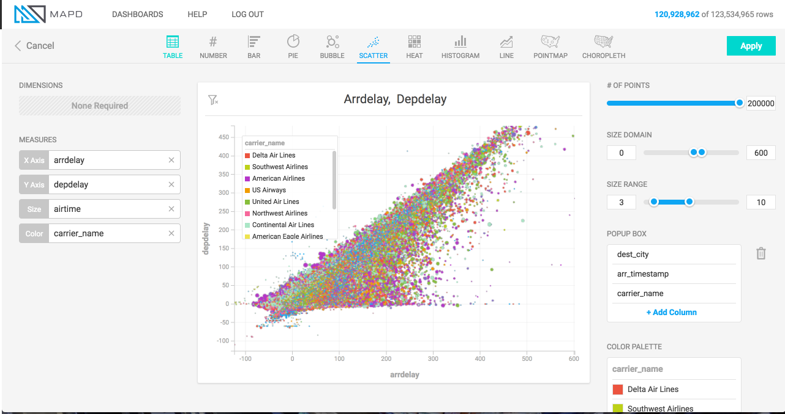

Immerse chart types
===================

MapD Immerse lets you quickly visualize your data in whichever format
provides the clearest insight.  Charts range from simple to complex,
from aggregate to detail level, and can be combined together into
dashboards to illuminate every dimension and level of your data.

Table chart
-----------

.. image:: ./images/table-header.*

What it is
~~~~~~~~~~

Table chart is a non-graphical output of data either at the row level
from the database, or with a grouping or aggregation.  Any grouped data
may be sorted to view top or bottom records for a measure.

When to use it
~~~~~~~~~~~~~~

Table charts are useful for viewing raw information at the most detailed
level from the database.  For example, let’s say your dashboard contains
an aggregated chart like Row Chart, which presents an aggregated measure
broken out by a particular dimension, a Table Chart can be a useful
supplementary chart to show every record underlying an aggregation.  I
might have a Row chart of cars sold per town in the United States, and I
might have a table chart showing details on each automotive transaction.
 Clicking on a dimension in the row chart would show the detailed
records for that dimension in the table chart.

In addition to presenting row-level, non-grouped information from the
database, table charts can also used to group information by a
Dimension, similar to most other chart types.  Since other chart types
have a limit on the number of measures which can be aggregated
(Bubble chart has the most, at 4), Table charts are useful if you’re
looking to view even more aggregated measures, since there is no
restriction on the number of columns which may be viewed.

How to set it up
~~~~~~~~~~~~~~~~

The animation uses an airline flights dataset to show the setup of a
table chart with 4 measure columns (arrival delay, departure delay,
flight time, and destination city), and then the grouping of those
columns by a Dimension (airline carrier name).

Note that before the carrier\_name  dimension is added to group the
information, the information is displayed at the row level from the
database, meaning each record corresponds with a row in the database
table.  Using this non-aggregated view is a unique and useful capability
of the Table chart.

.. image:: ./images/table-create.*

--------------

Number chart
------------

.. image:: ./images/number-header.*

What it is
~~~~~~~~~~

The Number Chart is simply one aggregate value, with no dimensions.  For
example, in the image above, the value is simply the average of a column
named “Amount,” for the entire column.  Aggregate types offered for
Number Chart are Avg, Min, Max, Sum, Count Unique (for string or
smallint data types), or Custom (where any SQL compatible custom
function can be applied; more on custom functions under
:ref:`custom_measures`).

When to use it
~~~~~~~~~~~~~~

Use a number chart when you want a simple, compact display of one
metric, and are not interested in breaking out that metric by time,
category, or some other dimension.  Multiple number charts could be
added to a dashboard to allow several aggregate calculations to be
viewed concurrently, for e.g. viewing the Max, Max, Avg, and Sum of a
column all at once.

How to set it up
~~~~~~~~~~~~~~~~

Since the Number Chart has no dimension, simply specify the column to be
aggregated, and choose the aggregation type.

.. image:: ./images/number-create.*

--------------

Bar chart
---------

.. image:: ./images/bar-header.*

What it is
~~~~~~~~~~

The Bar Chart allows a measure to be visualized based on the width of
the bar, broken out by one or more dimensions.  In addition to using the
width of the bar for one measure, color may be added to allow a second
measure to be visualized at the same time.

When to use it
~~~~~~~~~~~~~~

Visualizing “population by state” would be a classic bar chart scenario,
when you are looking to take a measure (“population”), and break it out
by a dimension (“state”).  Add a color measure if you wish to
concurrently visualize yet another measure (e.g. population and per
capita income by state).  Note that Bar Charts can also be used to
visualize more than one dimension (e.g. “population by state by
gender”).  In this case, the bar displays with a label showing each
dimension separated by a forward slash (e.g. “California / Female”).

How to set it up
~~~~~~~~~~~~~~~~

The animation below shows a bar chart being created for a political
donations dataset, with the width of the bar corresponding to the
average amount donated, the color of the bar corresponding with the
number of donations, and the dimension breaking out the data by
political office and by party.

.. image:: ./images/bar-create.*

--------------

Pie Chart
---------

.. image:: ./images/pie-header.*

What it is
~~~~~~~~~~

The Pie Chart represents the proportional size of one group to another
by representing them as slices of a circle (a “pie”).  It is a simple,
classic chart useful for representing a small number of categories.

When to use it
~~~~~~~~~~~~~~

Use a pie chart to show the relative proportion of a small number
categories to one another.  Avoid using pie charts when the number of
categories is large, since slices will become small and difficult to
discern.

How to set it up
~~~~~~~~~~~~~~~~

The animation below shows a pie chart being created for a political
donations dataset, with the dimension breaking out the data by political
office, the size of slices corresponding to the total amount raised, and
the color of slices representing the average donation amount.

This animation shows colors being set based on a numeric measure, but it
is also possible to manually set the colors of categories arbitrarily.
 Instructions on how to manually set colors are here .

.. image:: ./images/pie-create.*

--------------

Bubble chart
------------

.. image:: ./images/scatter-header.*

What it is
~~~~~~~~~~

The Bubble chart groups data into dots, and places those dots along an x
and y axis, with each axis representing a measure.  The dots can
optionally be sized or colored by further measures, making the
bubble chart capable of representing up to four measures for each group
(x, y, size, and color).

When to use it
~~~~~~~~~~~~~~

A Bubble chart can be useful in a few different situations, including: 1)
a dataset where you expect there may be a correlation between the x
measure and the y measure; 2) a dataset where a correlation is not
necessarily expected but where you simply are looking to understand the
distribution and influence of multiple factors, or to spot outliers.

For example, you might use a Bubble chart to examine automotive engine
performance by plotting horsepower on the X axis and engine displacement
on the Y axis.  More displacement usually means more horsepower, so you
would expect the dots to cluster along an angled line rising from left
to right.  To the extent that data deviates off of that imagined line,
you may infer a meaning: engines falling above the line would have
unusually high efficiency.

How to set it up
~~~~~~~~~~~~~~~~

The animation below shows a Bubble chart being created for an airline
flights dataset, with the dots representing airlines, the x and y axes
representing flight arrival delay and departure delay, size representing
the number of flights, and color representing the average length of
flight.

.. image:: ./images/scatter-create.*

--------------

Scatter plot
------------



What it is
~~~~~~~~~~
The Scatter plot displays unaggregated, row-level data as points, plotting the points along an x and y axis with each axis representing a quantitative measure.  Points can optionally be sized or colored by further measures, making the scatter plot capable of representing up to four measures for each group (x, y, size, and color).  Scatter plot resembles Bubble chart, but is used to view unaggregated data, as compared with Bubble chart’s aggregate view.

When to use it
~~~~~~~~~~~~~~

Similar to Bubble chart, use a Scatter plot when you want to study the correlation between two measures, or simply visualize the distribution of data to spot outliers or patterns.  Scatter plots can be used to visualize any size of dataset, but they really shine in their ability to quickly visualize large amounts of data.

How to set it up
~~~~~~~~~~~~~~~~

The animation below shows a scatter plot being created for an airline flights dataset, with each point representing a flight, the x and y axes representing flight arrival delay and departure delay, size representing the flight duration, and color representing the airline carrier.

On the right hand side of the screen, a popup box is configured, which displays columns of information whenever one of the points on the map is moused over.

Note also that once the Size measure is added on the left of the screen, controls become available on the right of the screen for “Domain” and “Range.”  Domain is used to establish limits on the data that is considered for sizing, Range is used to set the range of sizes (in pixels) for the points.  Domain and Range controls function in the same way in the Pointmap chart type, and a more detailed explanation of these controls’ use can be found in section :ref:`size-domain`.

.. image:: ./images/scatter.*

--------------

Heatmap
-------

.. image:: ./images/heatmap-header.*

What it is
~~~~~~~~~~

The Heatmap displays information in a two-dimensional grid of cells,
with each cell representing a grouping of data.  Relative value of the
cells is indicated by color, with color shifting from one end of a
spectrum for lower values, to the other end of a spectrum for higher
values.

When to use it
~~~~~~~~~~~~~~

Use a heatmap when you’re looking for a quick visual comparison of the
relative values of groups.  Heatmaps are ideal for spotting outliers,
which will show up vividly on the color spectrum.  They are also best
when the number of groupings is not huge, since large numbers of
groupings will cause the heatmap not to fit within a viewport, making
comparison harder (for such scenarios, scatterplot may be better).

How to set it up
~~~~~~~~~~~~~~~~

The animation below uses a political contributions dataset to create a
histogram of average donation amount, broken out by contributor state
and recipient state.  During setup of the chart, the minimum and maximum
of the color scale are tuned to give a clearer visualization.

.. image:: ./images/heatmap-create.*

--------------

Histogram
---------

.. image:: ./images/histogram-header.*

What it is
~~~~~~~~~~

The Histogram displays the distribution of data across a continuous
variable, by aggregating the data into bins of a fixed size.  Vertical
bars are used to show the count of data within each bin, with taller
bars indicating areas of density within the dataset.  In MapD Immerse,
Histograms may also be used to count occurrences of data other than the
binned dimension (shown in “How to set it up” below).

When to use it
~~~~~~~~~~~~~~

Use a Histogram to understand the distribution of your data, and to see
areas of unusually high or low density which would be masked by a simple
aggregate such as Average.

How to set it up
~~~~~~~~~~~~~~~~

The animation below uses Twitter data to set up two histograms.

The first histogram in the animation shows the distribution of data for
number of followers, indicating that a large number of people have fewer
than 150 followers, followed by a diminishing “long tail” of people with
more than that number.

The second histogram shown below forms bins based on one column
(followers), but draws the vertical height of the bars based on count of
a different column (the number of followees ).  This allows us to see
how the count of one column varies when viewed by groupings of another
column.  In this case, people with more followers also tend to follow
more accounts themselves, up to the level of about 20,000 followers, at
which point the relationship becomes more tenuous.

.. image:: ./images/histogram-create.*

--------------

Line Chart
----------

.. image:: ./images/line-header.*

What it is
~~~~~~~~~~

The line chart represents a series of data as a line or multiple lines,
plotted across time or across another numerical dimension.

When to use it
~~~~~~~~~~~~~~

Use a line chart when you want to view how a measure changes across the
course of time, or across the range of some other dimension.  The
optional multi-series capability of line chart is a useful tool for
breaking out values by an additional dimension, for example, as shown
above, to compare the number of daily flights to several cities over
time.

How to set it up
~~~~~~~~~~~~~~~~

The animation below uses a political contributions dataset to create a
histogram of average donation amount, broken out by contributor state
and recipient state.  During setup of the chart, the minimum and maximum
of the color scale are tuned to give a clearer visualization.

.. image:: ./images/line-create.*

--------------

Point map
---------

.. image:: ./images/pointmap-header.*

What it is
~~~~~~~~~~

The pointmap plots geographic latitude/longitude data on map, allowing
for the location of data to be visualized.  In addition to location,
points on the map may be sized and colored to represent measures of
data.  Mousing over a point can reveal a popup box with further details
on that point.

When to use it
~~~~~~~~~~~~~~

Use a pointmap when you would like to view a detailed, grain-level
display of geographic information, and your data is at the
latitude/longitude level of detail.  The pointmap does not aggregate
data, but presents it as individual, lat/long rows from the database
table (if you need aggregation of geographic data, use the Choropleth
chart).

How to set it up
~~~~~~~~~~~~~~~~

The animation below shows the selection of Longitude and Latitude
measures to plot the location of points, and the selection of color and
size measures, to add additional detail.  The animation also shows the
adjustment of settings for “Size Domain” and “Size Range,” which are
used to adjust how points are sized.  

.. _size-domain:

Size Domain
^^^^^^^^^^^

The Size Domain setting lets you set minimum and maximum bounds for the
Size Measure which you’ve chosen.  For example, in the animation below,
which uses U.S. political contributions data, the Size Measure chosen at
the left side of the screen is “Amount,” which has values from -5m to
over 25m.  The majority of political donations are not millions of
dollars, and are not negative, so by adjusting Size Domain we can make
sure the sizing of the dots on the pointmap is determined by a more
realistic minimum/maximum bounds ($0 - $5,000 is used here).

Note that setting minimum/maximum bounds using Size Domain does not
exclude values outside of those bounds from the dataset— they do still
appear on the map.  Rather, the Size Domain sets the minimum value,
which will be used to size the smallest point, and maximum value, which
will be used to size the largest point.  In other words, if I set the
maximum for Size Domain to be $5,000, any point greater than $5,000 will
appear at the exact same size as one which is $5,000.

The practical effect of Size Domain is to control the impact of
outliers, and enable a more informative map for the range of values
which are most pertinent to an analysis.

Size Range
^^^^^^^^^^

Size Range represents sizes of the smallest and largest points, as
measured in pixels on the screen.  Points may range in size from 1 pixel
to 20 pixels.  Note that by setting very large pixel values for the top
of the range (e.g. 20), you may find that those largest points cover
many smaller points which fall underneath them.  Accordingly, setting
size ranges is a balance between making it easy to spot the largest
values with very large points, and comprehensiveness of the data which
can be viewed (using smaller point ranges allows more points to be seen
on the map).

.. image:: ./images/pointmap-create.*

--------------

Choropleth
----------

.. image:: ./images/choropleth-header.*

What it is
~~~~~~~~~~

The choropleth, from the Greek ```choros`  (area) `pleth`  (value), is a map
which allows comparison of numerical information across regions, by
coloring regions based on the relative size of a numerical measure
across regions.  The map is colored from a low intensity color to a high
intensity color, allowing comparison of values of one region to another.

When to use it
~~~~~~~~~~~~~~

Use a choropleth when you’re looking to compare the average value (or
any other aggregate value such as SUM, COUNT, etc.) across multiple
regions.  Choropleths are useful for spotting outlier regions, but are
not intended to provide great detail on the values within a particular
region, since they present aggregate-level information only.  (For
detailed, point-level geographic information, try Pointmap.)

How to set it up
~~~~~~~~~~~~~~~~

The animation below shows the selection of a Dimension of a column
containing names of US Counties, the selection of Geojson (region
shapes) matching that region type, and the selection of a measure.
 Chart title is then shown to be edited to a more informative title.

In addition to US counties Geojson, the user may also select Countries
or US States.

Geojson is a file format which contains the shapes which will be
rendered on the map.  In order to match the geojson shapes onto the Geo
Dimension which the user selects, it’s necessary that the region names
between the two match one another.

.. image:: ./images/choropleth-create.*
