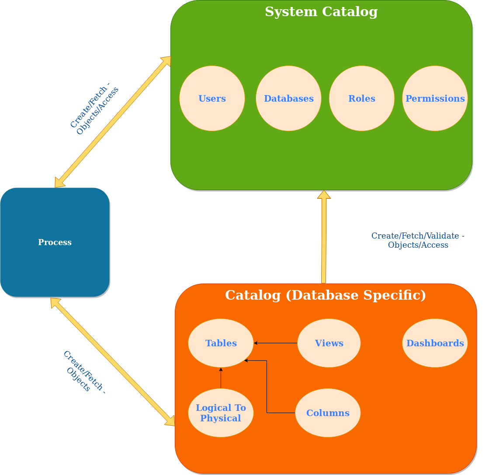
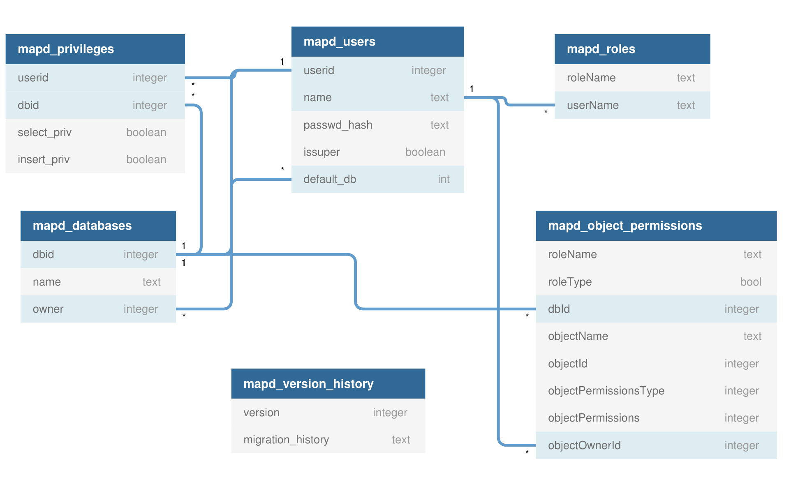
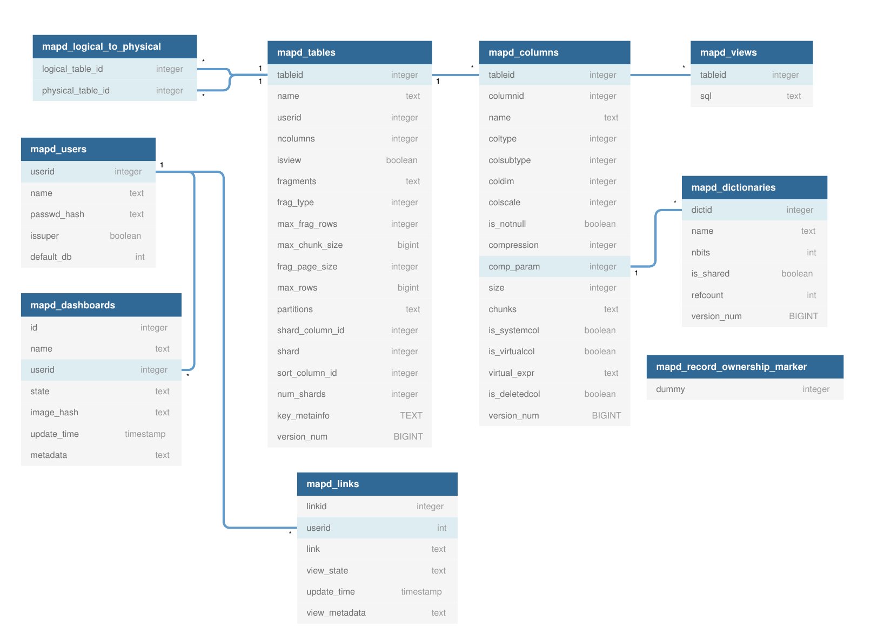

## High Level Overview

HeavyDB stores database, table, and user information in a centralized `Catalog`. Each database has its own `Catalog`, with the top-level *System Catalog* (`SysCatalog`) managing catalogs across databases. Each catalog (including the system catalog) is backed by a `SQLite` database in the `catalogs` directory (a top-level directory in the HeavyDB data directory). In addition to managing catalogs for individual databases, the `SysCatalog` manages users, roles, and higher-level object permissions.

Both SysCatalog and Catalog classes are defined in files of the same name in the `Catalog` source directory. All catalog-related code lives inside the `Catalog_Namespace`.

## System Schema (SysCatalog)

`Catalog_Namespace::Catalog` is a singleton class responsible for managing top-level HeavyDB server metadata, including:

- Users
- Roles
- Databases
- Permissions

Data is persisted using a *SQLite* database at `<path_to_db/catalogs/system_catalog>`. When the `SysCatalog` is created, the contents of the SQLite database is read and stored in memory. Subsequent reads only reference in-memory data structures. All writes are immediately flushed to SQLite.

Below is a UML representation of the schema of the SQLite database backing the system catalog:

### Users

User accounts in HeavyDB are global (that is, one user account can have access to multiple databases). The users login information is stored in the `mapd_users` system catalog table. When a user is authenticated, a `UserMetadata` struct is created to provide an in-memory representation of the user.

### Roles

Roles are used to grant permissions to groups of users. Roles are stored in the `mapd_roles` table. Each user also has a role corresponding to the name of the user, e.g. adding a user `Max` will also add a corresponding role called `Max` automatically.

### Databases

The `mapd_databases` table functions as a lookup table for mapping a database name (a string) to the internal database identifier (an integer).

### Permissions

All system-level object privilege grants are stored and accessed from the `mapd_object_permissions` table. An object permission can be assigned to a role and specifies the access that role has to parts of the system. See [Roles](https://docs.nvidia.com/heavyai/installation-and-configuration/security/roles) for the user-facing privilege commands.

The `granteeMap_` in the `SysCatalog` class stores `Grantee` objects, representing object level permissions grants. The `granteeMap_` is built at startup.

The `objectDescriptorMap_` in the `SysCatalog` class stores `ObjectRoleDescriptor` objects that relate roles to specific privilege grants. Like the `granteeMap_`, it is built at startup. Together, the two maps are referenced when determining whether a user can perform an action in the database.

## Database Schema (Catalog)

The `Catalog_Namespace::Catalog` is the top-level container for schemas associated with an individual database. When the HeavyDB data directory is initialized, an initial "default" database is created. HeavyDB always has at least one catalog at startup. The `Catalog` maintains the following objects:

- Tables
- Columns
- Views
- Dashboards
- mapd_dictionaries

Data is persisted using a *SQLite* database per catalog in the `catalogs` directory, with the name of the *SQLite* database file corresponding to the database name. Just like the `SysCatalog`, a `Catalog` loads all data from SQLite on creation and flushes writes to SQLite immediately.

Below is a UML representation of the schema of the SQLite database backing a catalog:

### Tables

Tables metadata for all tables in a given database is stored in the `mapd_tables` *SQLite* table and read by the `Catalog` at startup. Table metadata is stored in the `TableDescriptor` object for access by other objects in the system. For a given table, the `TableDescriptor` both holds table metadata (`id`, `fragment size`, etc) and is responsible for instantiating the `Fragmenter` for the table. That is, the `TableDescriptor` is the primary interface to locating storage for a given table.

### Columns

Column metadata is stored in the `mapd_columns` table. Each column is uniquely identified by an ID pair, mapping to a unique table ID and a unique column ID within that table. `ColumnDescriptor` objects pass column metadata (including the `SQL Type` of a column) throughout the system.

### Dictionaries

Columns of type `dictionary encoded string` require a separate string dictionary. The string dictionary metadata is stored in the `mapd_dictionaries` SQLite table. `DictDescriptor` objects encapsulate string dictionary information. Like the `TableDescriptor`, `DictDescriptor` is the primary interface for accessing physical string dictionary storage.

### Sharded Tables

HeavyDB supports `sharded tables` -- that is, a table partitioned by a predefined column (called the `shard key`) into a pre-determined number of `physical tables`, more commonly referred to as `shards`. Sharding is used for increasing performance by grouping like data on like devices. Internally, a sharded table is represented as a top-level `logical` table and several underlying `physical` tables (with the number of physical tables corresponding to the total shard count). This mapping is stored in the `mapd_logical_to_physical` *SQLite* table.

### Views

Views in HeavyDB are currently not materialized during creation. Instead, the definition for the view is stored in the `mapd_views` *SQLite* table, and the view is materialized lazily when the view is queried. By using lazy materialization, HeavyDB fuses the query on the view with the underlying table(s) backing the view, reducing the number of intermediate projections required and/or the amount of data that must be loaded and processed. Views are represented by a `TableDescriptor` object with the `isView` boolean member set to `true`.

### Temporary Tables

HeavyDB supports temporary tables. Temporary tables can be created using `CREATE TEMPORARY TABLE` and can contain scalar, array, string, and geospatial columns. Their data is stored in CPU memory and persists until the server is restarted. Some operations have additional restrictions for temporary tables; in particular, GEOS-backed functions do not currently support geometry columns stored in temporary tables.

Temporary tables are identified by checking the `persistenceLevel` property of the `TableDescriptor`. A free function, `table_is_temporary`, is available for convenience.

Note that [calcite_parser](../calcite/calcite-parser.mdx) relies on reading the sqlite catalog files directly for unit testing. To test temporary tables, a separate JSON file is created in the catalog directory for each database containing temporary table metadata. See [Communication between Calcite and HeavyDB](../calcite/calcite-parser.mdx#communication-between-calcite-and-heavydb) for more details.

### Dashboards

HeavyDB holds the dashboard state for Heavy Immerse (Enterprise Edition only), our web-based data exploration tool. Dashboards are serialized and stored in the `mapd_dashboards` table. Because dashboards are built over a database and typically contain many database objects, they are considered a top-level object in the HeavyDB catalog and object permissions model.

## Migration

HeavyDB includes a schema migration service for migrating user catalog information between versions. The schema migration service can also drive storage level migrations. The `mapd_version_history` table enables tracking whether or not a migration has been performed. When changing `SysCatalog` or `Catalog` *SQLite* schema, migrations must be used to ensure previous data directories work properly.
