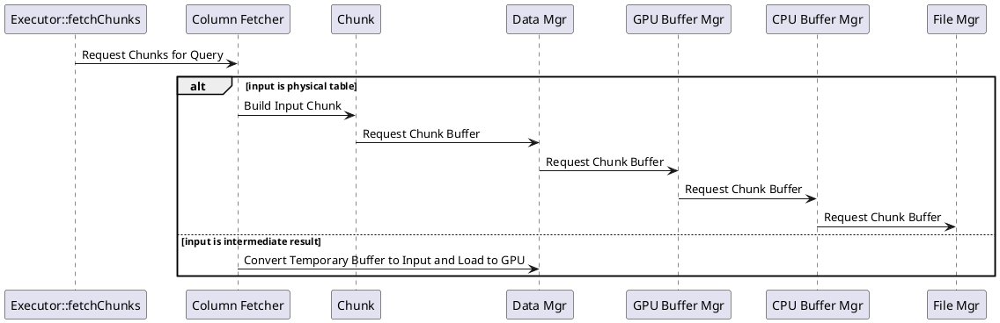

A SQL query is essentially a series of transformations on some input data. While the input to the query engine is a SQL query, the query engine (and more so, the `Executor`) can be thought of a black box which builds a transformation, loads data, applies the transformation, and returns the result. In the following section, we provide a summary of how data flows through the system, from physical storage on disk through the memory hierarchy to the output.

## Input Data

All requests for input data start from the `Executor`. The executor loads chunks required for a query to device memory by making a call into the standalone `ColumnFetcher` class. The `ColumnFetcher` makes calls directly into the buffer manager hierarchy and storage layer to ensure requested chunks are available in the appropriate memory level for the device.

The following schematic illustrates the process for requesting inputs for a query step, from storage through to the execution device (in this example, a GPU).

<Note>TODO: render this diagram to an image and replace this code block.</Note>

For a **physical table**, input data is loaded from the storage layer (see [Physical Layout](../data-model/physical-layout.mdx) and [Columnar Layout](../data-model/columnar-layout.mdx)) via the buffer manager hierarchy (see [Memory Layout](../data-model/memory-layout.mdx)). If the data is already present on GPU, the request terminates with the `GPU Buffer Mgr`. If not, the request passes on to the parent manager until it reaches storage.

For **intermediate results**, input data is loaded directly from a per-query temporary tables map and transferred to the GPU directly via the `Data Mgr`.

For temporary-table behavior and restrictions, see [Catalog](../catalog/index.mdx).

## Output Data

Query step outputs are managed by the `ResultSet` (see [Query Results](../execution/results.mdx)). However, some intermediate buffers may still be required after a query completes. The `RowSetMemoryOwner` is a helper structure for managing the lifetime of all outputs related to a given query. The `ResultSet` holds a shared pointer to the `RowSetMemoryOwner`, ensuring that the data held by a `ResultSet` is always valid until the `ResultSet` class is destroyed.
