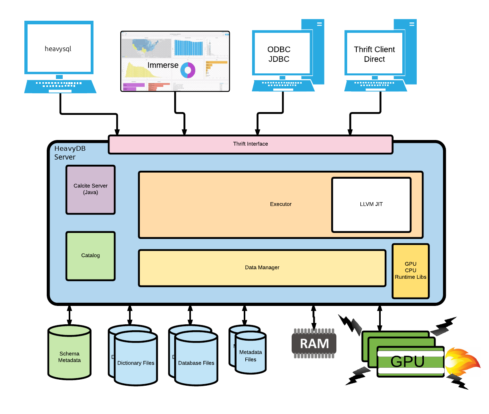
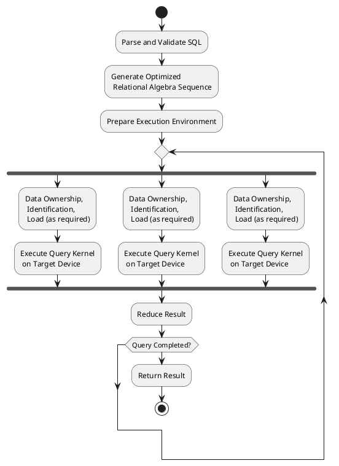

HeavyDB is made up of several high level components. A diagram illustrating most of the components of the system is displayed below, with a short description of each major section of the documentation following.

## High Level Diagram

The major components in the above diagram and their respective reference pages are listed in the table below.

| Component | Reference Page |
| --- | --- |
| Thrift Interface | [External API](../data-model/api.mdx) |
| Calcite Server | [Calcite Parser](../calcite/calcite-parser.mdx) |
| Catalog | [Catalog](../catalog/index.mdx) |
| Executor | [Execution Overview](../execution/overview.mdx) |
| LLVM JIT | [Code Generation](../execution/codegen.mdx) |
| CPU / GPU Kernels | [Execution Kernels](../execution/kernels.mdx) |
| Database Files, Metadata Files, Dictionary Files | [Physical Data Layout](../data-model/physical-layout.mdx) |
| Foreign Storage (FSI) | [Foreign Storage Interface (FSI)](../foreign-storage/index.mdx) |
| Table Functions | [Table Functions](../table-functions/index.mdx) |
| Machine Learning Models | [Machine Learning Models](../ml-models/index.mdx) |
| Row-Level Security | [Row-Level Security (RLS)](../security/row-level-security.mdx) |
| Memory / Runtime | [Memory and Execution Runtime](../runtime/index.mdx) |
| Server Configuration | [Server Configuration Overview](../configuration/index.mdx) |

## Data Model

The [Data Model](../data-model/index.mdx) section provides an overview of the data formats and data types supported by HeavyDB. A brief overview of various storage layer components is also included.

## Data Flow

The [Data Flow](../flow/data.mdx) section ties together the [Data Model](../data-model/index.mdx) and [Query Execution](../execution/index.mdx) sections, providing information about the complete flow of data from the input columns for a query to its projected outputs.

## Query Execution

The [Query Execution](../execution/index.mdx) section provides an overview
of how a query is executed inside HeavyDB.

At a high-level, all SQL queries made to the server pass through the
[Thrift](https://thrift.apache.org/) `sql_execute` endpoint. The query string is passed to Apache [Calcite](https://calcite.apache.org/)
for parsing and cost-based optimization, yielding an optimized relational
algebra tree. This relational algebra tree is then passed through HeavyDB-specific
optimization passes and translated into a HeavyDB-specific abstract syntax tree (AST).
The AST provides all the information necessary to generate native machine code for
query execution on the target device. Execution then occurs in parallel on the target
device, with device results being aggregated and reduced into a final `ResultSet`
for each query step.

The sections following provide in-depth details on each of the
stages involved in executing a query.

## Simplified Execution Model

<Note>TODO: render this diagram to an image and replace this code block.</Note>
