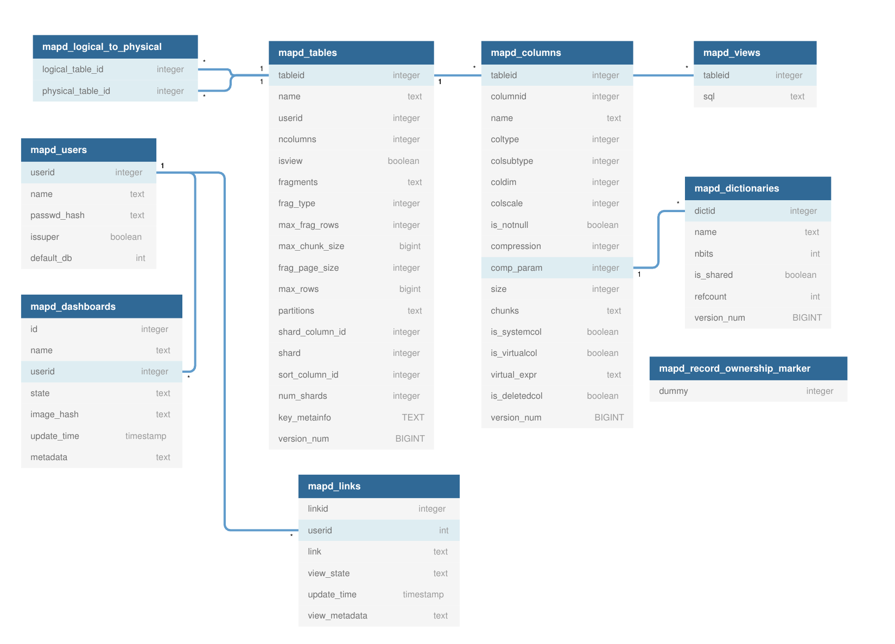

``Catalog`` class is responsible for responsible for metadata of a specific database. The default database is ``omnisci``.
Below are the objects that are maintained by Catalog:

- Tables
- Columns
- Views
- Dashboards
- mapd_dictionaries

Catalog holds the data of objects in their respective tables in ``<path_to_db/mapd_catalogs/<db_name>>`` SQLite database and is also cached in memory for fast access.

Below is the general schema of a Catalog SQLite database:

In the above diagram, ``physical_table_id`` and ``logical_table_id`` in mapd_logical_to_physical are foreign keys to ``mapd_tables.tableid``.

****************************************
Tables
****************************************

.. include:: ./tables.rst

****************************************
Columns
****************************************

.. include:: ./columns.rst

****************************************
Dictionaries
****************************************

.. include:: ./dictionaries.rst

****************************************
Logical to Physical Mapping
****************************************

.. include:: ./logical_to_physical.rst

****************************************
Views
****************************************

.. include:: ./views.rst

****************************************
Dashboards
****************************************

.. include:: ./dashboards.rst
