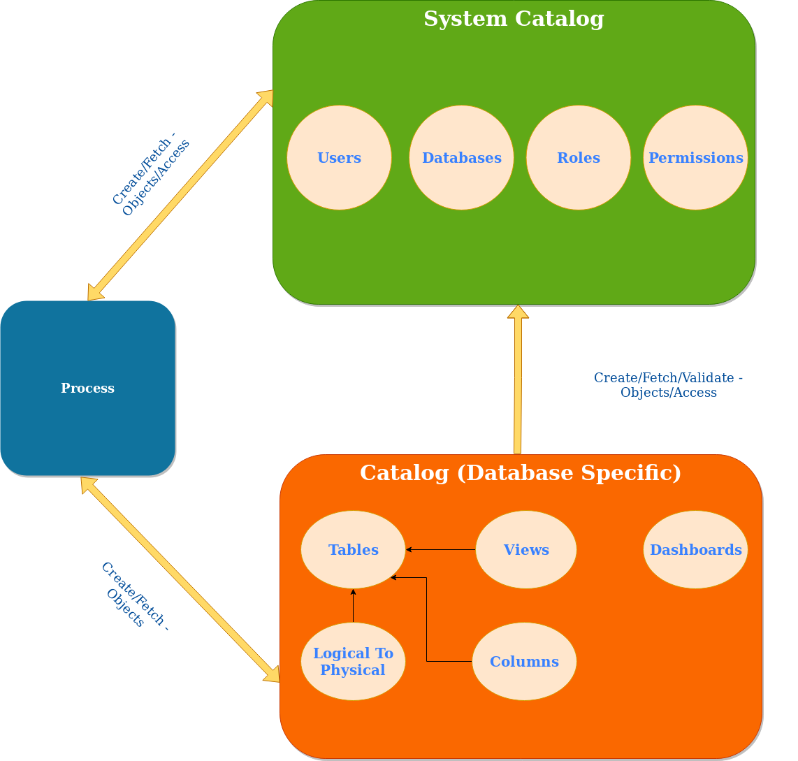

Omnisci metadata operations are handled by SysCatalog and Catalog classes, each storing its data in a separate SQLite database in <path_to_db>/mapd_catalogs/. Every separate Catalog instance is a representation of a separate OmniSci database, while SysCatalog is only one and represents metadata global for the whole OmniSci server and shared between databases: roles, users, list of databases, etc. 

Both SysCatalog and Catalog classes are defined in ``Catalog_Namespace``.

