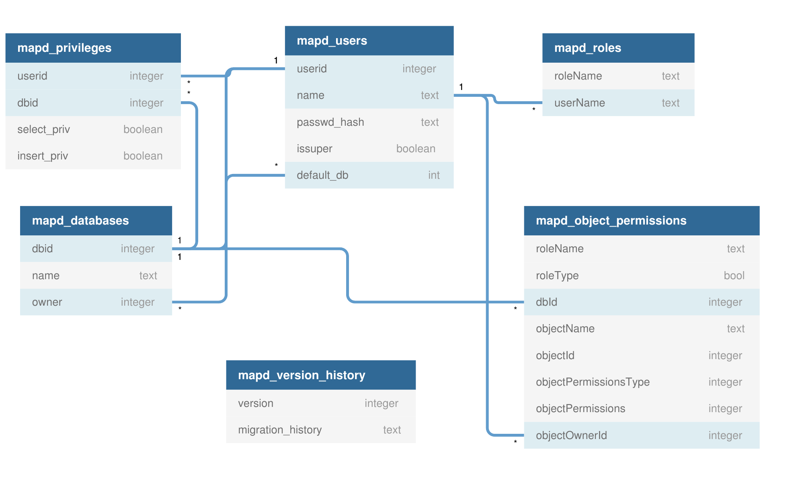

``SysCatalog`` is a `singleton class <https://en.wikipedia.org/wiki/Singleton_pattern>`_ responsible for managing the global OmniSci server metadata.

Below are the objects that are maintained by System Catalog:

- Users
- Roles
- Databases
- Permissions

The data is persisted on disk in the SQLite database at <path_to_db/mapd_catalogs/omnisci_system_catalog> and also cached in memory in different structures to speed-up look-ups.

Below is the general schema of ``omnisci_system_catalog``:

In the above diagram, ``UserName`` and ``roleName`` in mapd_roles refer to ``mapd_users.name`` and ``mapd_.name``.

****************************************
Users
****************************************

.. include:: ./users.rst

****************************************
Roles
****************************************

.. include:: ./roles.rst

****************************************
Databases
****************************************

.. include:: ./databases.rst

****************************************
Permissions
****************************************

.. include:: ./permissions.rst