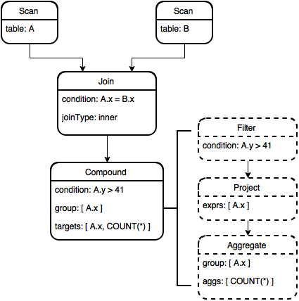

.. OmniSciDB Query Execution

==================================
Interpreter / Optimizer
==================================

The ``RelAlgAbstractInterpreter`` and ``RelAlgOptimizer`` are responsible for deserializing the relational algebra tree returned from Calcite (see :doc:`../calcite/calcite_parser`) and building a relational algebra tree using OmniSciDB specific data structures. The OmniSciDB RA Tree then passes through several optimization passes. The process of building the OmniSciDB tree and a description of the optimization passes currently employed follows. 

Interpreter
===========

The class ``RelAlgAbstractInterpreter`` deserializes the JSON string containing the optimized relational algebra tree from Calcite. The interpreter file also includes a class hierarchy for defining relational algebra nodes (``RelAlgNode``) and relational algebra node expressions (``Rex``). The run method iterates the list of relational algebra nodes present in the JSON and calls a deserialization function for each node. The deserialization function returns a class derived from ``RelAlgNode`` -- the type of the class corresponds to the type of relational algebra node. A complete list of currently supported relational algebra nodes is available in the table below.

=====================  =======================  ==================================================================
Calcite Node Type      ``RelAlgNode`` Subclass    Calcite Description
=====================  =======================  ==================================================================
EnumerableTableScan    RelScan                  Returns the contents of a table through
                                                sequential traversal.
LogicalProject         RelProject               Computes a set of 'select expressions'
                                                from its input relational expression.
LogicalFilter          RelFilter                Iterates over its input and returns
                                                elements for which condition evaluates to true.
LogicalAggregate       RelAggregate             Eliminates duplicates and computes
                                                totals. It corresponds to the `GROUP BY` operator in a SQL query
                                                statement, together with the aggregate functions in the `SELECT`
                                                clause.
LogicalJoin            RelJoin                  Combines two relational expressions
                                                according to some condition. Each output row has columns from
                                                the left and right inputs.
LogicalSort            RelSort                  Imposes a particular sort order on
                                                its input without otherwise changing its content. Also used to
                                                represent a `LIMIT` or `OFFSET`.
LogicalValues          RelLogicalValues         Relational expression whose value is a sequence of zero or more
                                                literal row values.
LogicalTableModify     RelModify                Modifies a table. Expression occurs
                                                as a result of `DELETE`, or `UPDATE` SQL statements.
=====================  =======================  ==================================================================

``RelAlgNode``
--------------

The ``RelAlgNode`` base class stores the relationship between RA nodes in the RA tree. Additionally, the ``RelAlgNode`` stores a pointer to its execution results after the step described by the node has been executed, as well as the final type information for the nodes targets. Derived classes may store additional information (e.g. the ``RelScan`` object contains a pointer to the ``TableDescriptor`` for the table being scanned). 

``Rex``
--------

The ``Rex`` class is a pure virtual base class ensuring all ``Rex`` derived objects can be serialized to a string. ``Rex`` derived objects must implement the `toString()` method, but are otherwise free to include their own expression-specific member variables and methods. The main ``Rex`` objects are described in the table below.

===================   ==============================================================
Object Name           Description
===================   ==============================================================
RexAbstractInput      Placeholder for a ``RexInput`` object, resolved 
                      after all node objects have been created.
RexInput              Input expression. Directly references a source ``RelAlgNode``
                      object.
RexLiteral            Literal expression. 
RexAgg                Aggregate expression. 
RexOperator           Unary or binary operator expression (e.g. `CAST` or `AND`). 
                      ``RexOperator`` will have one or more operands, which are 
                      owned by the operator object.
RexCase               Case expression. Stores operands for `when`, `then`, and
                      `else` similarly to ``RexOperator``.
RexSubQuery           Scalar subquery expression. ``RexSubQuery`` nodes are  
                      dispatched 
                      prior to all other nodes and the subquery result is replaced 
                      prior to step execution.
RexFunctionOperator   Function expression.    
RexRef                Synthetic expression node allowing a column in a group by to 
                      be referenced directly by the projection.
===================   ==============================================================

OmniSciDB Specific Query Optimization
=====================================

Once all node objects have been built, the OmniSciDB relational algebra tree passes through several optimization phases. Each optimization is described below. 

Mark Noops
----------

Aggregate RA nodes represent group by operations. In the case where a group by operation is repeated, subsequent aggregate nodes can be marked as a `noop`. If a node is marked as a `noop`, the result from the node immediately preceding the aggregate is simply forwarded during query execution. Below is an example SQL query which contains a `noop` node: 

.. code-block:: sql

  SELECT first_name FROM (SELECT first_name FROM Users GROUP BY first_name) GROUP BY first_name;
  
Calcite generates the following RA tree. 
  
.. code-block::

  Explanation
  LogicalAggregate(group=[{0}])
    LogicalAggregate(group=[{0}])
      LogicalProject(first_name=[$0])
        EnumerableTableScan(table=[[mapd, Users]])
  
The second aggregate node is clearly a duplicate of the first. Therefore, the second aggregate node is marked as a `noop` and the result from the first node (after the project) is forwarded.

.. note::
  The RA tree inspected by prefixing any `SELECT` query with ``explain calcite``.

Eliminate Identical Copies
--------------------------

Detects and removes project nodes which forward targets to other project nodes higher in the relational algebra tree. Eliminating identical copies reduces intermediate buffer use. But, more importantly, this optimization step prepares the RA tree for further manipulation in the steps below. 

Fold Filters
------------

Detects two identical filter nodes and folds the filters into a single filter node using the binary operator `AND`. Calcite typically folds most filters automatically during query operation. However, if an intermediate buffer is removed during the eliminate identical copies step, additional opportunities for filter folding may exist. Consider the following example:

.. code-block:: sql
  
  SELECT x, y FROM (SELECT a.str AS str, b.x AS x, a.y AS y FROM test a, join_test b WHERE a.x = b.x) WHERE str = 'foo' ORDER BY x LIMIT 1;

The generated RA from Calcite is:

.. code-block:: 
  :linenos:

  LogicalSort(sort0=[$0], dir0=[ASC], fetch=[1])
  LogicalProject(x=[$1], y=[$2])
    LogicalFilter(condition=[=($0, 'foo')])
      LogicalProject(str=[$10], x=[$35], y=[$1])
        LogicalFilter(condition=[=($0, $35)])
          LogicalJoin(condition=[true], joinType=[inner])
            EnumerableTableScan(table=[[omnisci, test]])
            EnumerableTableScan(table=[[omnisci, join_test]])

The project node on line 4 can be removed, with its projected targets pushed to the project node on line 2 (see `eliminate identical copies`). Once the project node on line 4 is removed, the filters on lines 3 and 5 can be folded. 

Eliminate Dead Columns
----------------------

Intermediate projection nodes may sometimes load more inputs than are actually required by subsequent nodes. In OmniSciDB, each projection node input is loaded into memory and projected through as an output target. The dead columns elimination step ensures that only columns that are be used in subsequent projections are loaded into memory. As an example, consider the following table and query:

.. code-block:: sql

  CREATE TABLE dead_cols_test (x INT, y FLOAT);

  SELECT t1.x FROM dead_cols_test t1 JOIN (SELECT * FROM dead_cols_test) t2 ON t1.x = t2.x;

The Calcite generated plan is:

.. code-block::
  :linenos:

  LogicalProject(x=[$0])
    LogicalJoin(condition=[=($0, $3)], joinType=[inner])
      EnumerableTableScan(table=[[mapd, dead_cols_test]])
      LogicalProject(x=[$0], y=[$1], rowid=[$2])
        EnumerableTableScan(table=[[mapd, dead_cols_test]])

Note that the projection on line 4 is projecting the `y` column (as part of the `select *` expansion in the right hand side join condition). But, `y` is not used in a subsequent projection; therefore, we can eliminate `y` and avoid loading the column for `y` into the memory hierarchy. 

Separate Window Function Expressions
------------------------------------

OmniSciDB currently requires window function expressions to be top-level expressions on their corresponding RA node. To ensure window function expressions can be embedded in other expressions, we detect the presence of embedded window function expressions and "split" the expression, pushing the top-level expression up to a new projection node, replacing the window function expression in the top-level expression with an input expression, and finally replacing the existing top-level expression in the current projection node with the window function expression. 

For example, consider the simple expression `LAG() - 1`. The top level expression is a ``BinaryOperator`` (with the op type of `-`, left hand side `LAG()`, and right hand side `1`). We detect the presence of the embedded window function expression, make a copy of the binary operator expression, forward it to a new projection node, and replace the window function expression with an input. Now we have ``BinaryOperator`` with the op type `-`, the left hand side an input target from the previous projection, and the right hand side `1` as before. Finally, we replace the existing binary operator with the top-level window function expression on the existing project node.

Coalesce Nodes 
--------------

Calcite generates canonical relational algebra. Sometimes, executing operations in the canonical order would involve redundant intermediate buffers. The use of intermediate buffers must be minimized to ensure the highest utilization of available compute and memory resources. Therefore, we walk the RA DAG looking for patterns to be coalesced into a synthetic node to be executed without intermediate buffers while preserving the observable effects. 

For example, we coalesce the `Filter`, `Project`, `Aggregate` chain into a single synthetic node, which we call ``RelCompound``. The compound node evaluates the filter and the aggregate on the fly and avoids the intermediate buffers for `Filter` and `Project` outputs. 
Consider the following example: 

.. code-block:: sql

  SELECT A.x, COUNT(*) FROM test JOIN B ON A.x = B.x WHERE A.y > 41 GROUP BY A.x;

The RA tree before and after the coalesce nodes optimization is depicted before (nodes before optimization are drawn with dashed lines). The Compound node now contains all information needed to evaluate the filter and (potentially grouped) aggregates using just the memory buffer required for the final result.

Create Left Deep Join
---------------------

The ``RelLeftDeepJoin`` node is another synthetic node, similar to ``RelCompound``, which allows multiple join loops to be nested in join loops to be nested in a single operator. Consider the following example:

.. code-block:: sql
  
  SELECT COUNT(*) FROM a JOIN b ON a.x = b.x JOIN c ON b.x = c.x;

Calcite generates the following RA tree:

.. code-block::
  :linenos:

  LogicalAggregate(group=[{}], EXPR$0=[COUNT()])
    LogicalProject($f0=[0])
      LogicalJoin(condition=[=($2, $4)], joinType=[inner])
        LogicalJoin(condition=[=($0, $2)], joinType=[inner])
          EnumerableTableScan(table=[[omnisci, a]])
          EnumerableTableScan(table=[[omnisci, b]])
        EnumerableTableScan(table=[[omnisci, c]])

The join nodes on lines 3 and 4 can be coalesced into a single join node, as long as the join condition on line 4 is checked before line 3. The ``RelLeftDeepJoin`` node coalesces multiple join conditions into a single node, and dictates the ordering of the join conditions during code generation.
