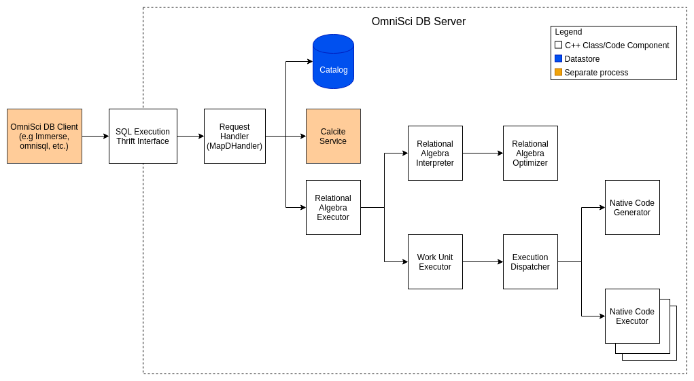

Overview
========

Here, we describe the various components that make up OmniSciDB's
Query Execution engine. Examples of typical query execution workflows
are provided in order to illustrate component roles and interactions.

Architecture
------------

|image0|

High-Level Services
----------------------

Request Handler (MapDHandler)
~~~~~~~~~~~~~~~~~~~~~~~~~~~~~

The :code:`MapDHandler` class is responsible for executing business logic for
all requests handled by the OmniSci DB server. There are a number of
endpoints provided by the :code:`MapDHandler` class used to communicate
which can be used to communicate with the `OmniSciDB` Server.

The :code:`MapDHandler::sql_execute()` is the endpoint through which queries
are executed. This endpoint orchestrates the query from start to finish,
and returns a :code:`TResultSet` to the Thrift caller.

Calcite Service
~~~~~~~~~~~~~~~

The Calcite service provides a Thrift API that enables transformation of raw
SQL query statements/strings to `relational algebra
expressions <https://calcite.apache.org/docs/algebra.html>`__ in JSON
format. A relational algebra expression can be considered a form of the
SQL query that has been broken down into simple discrete steps.
See the :doc:`Workflows <workflows>` section for examples of how
the relational algebra output looks under various use-cases.

The Calcite service is run as a child process of the OmniSci DB server.
Calcite server management and API access business logic can be
found in :code:`Calcite.cpp`.

.. note::
    Calcite is used only for DDL statements. For DML statements,
    a Bison-based parser is used.

Executing Relational Algebra 
-----------------------------

The Relational Algebra Executor provides a second layer of orchestration for
executing the resulting relational algebra expression received from the
Calcite service.

This component converts Calcite's relational algebra nodes
to an optimized internal representation, represented by :code:`RelAlgNode`
and it's derivatives.

The Relational Algebra Executor creates "work units" for
each relational algebra node and delegates
execution of these work units to the work unit executor.
Work unit creation also involves creation of "analyzer
expressions" objects from relational algebra nodes.

Prior to execution, the code generator component transforms
analyzer expression objects, then compiles them into executable
device code using `LLVM`.

After execution, a :code:`ResultSet` is sent back to the
request handler (:code:`MapDHandler`) and ultimately returned to
the Thrift client.

The intermediary steps involved in Relational Algebra execution
are described below.

.. note::
    The Relational Algebra executor handles execution hand-off
    from CPU to GPU when a downstream layer throws a
    :code:`QueryMustRunOnCpu` exception.

Relational Algebra Interpreter
~~~~~~~~~~~~~~~~~~~~~~~~~~~~~~

The Relational Algebra Interpreter converts relational algebra expressions
provided by Calcite's JSON format to an internal
representation referred to as relational algebra nodes (in code, these
are sub-classes of the :code:`RelAlgNode` class).
The interpreter then performs optimizations on the generated relational
algebra nodes using the relational algebra optimizer.

Relational Algebra Optimizer
~~~~~~~~~~~~~~~~~~~~~~~~~~~~

Relational algebra optimizer, as the name implies, performs optimization
on relational algebra nodes. These optimizations entail identifying and
marking no op nodes, eliminating duplicate nodes, combining multiple
nodes into compound nodes, pruning unused columns, etc.

Work Unit Executor
~~~~~~~~~~~~~~~~~~

The work unit executor is the component (implemented by the *Executor*
class) that is responsible for executing work units created by the
relational algebra executor. In order to execute a work unit, this
component creates an :code:`execution dispatch` object, which abstracts
generation of compiled code for the work unit,
spins off a thread for each fragment involved in query execution,
executes generated code against appropriate fragments (and chunks/column
buffers)
and gathers the results from each thread execution and device (e.g
CPU/GPU) into one result set.

Execution Dispatcher
~~~~~~~~~~~~~~~~~~~~

Execution dispatcher encapsulates compilation/generation of code for a
given work unit and execution/running of the generated code. Work unit
code generation/compilation is managed by the CodeGenerator with native code generation handled by the Executor. Running/execution of generated code is implemented by
the executor. This component is implemented by the
:code:`Executor::ExecutionDispatch` class.

Native Code Generator
~~~~~~~~~~~~~~~~~~~~~

Native code generator is the component that is responsible for
generating code that corresponds to a work unit. Native code generator
uses LLVM C++ libraries to build logical code blocks (that are mainly
based on analyzer expressions contained within the work unit) and
generate an intermediate representation (LLVM IR) of the code. The
intermediate representation may be different for CPU vs GPU depending on
the use case. For CUDA GPU use cases, the LLVM IR intermediate
representation is converted to another intermediate representation
called
`PTX <https://docs.nvidia.com/cuda/parallel-thread-execution/index.html>`__,
which is then converted to an executable.
Native code generator also performs optimizations on the LLVM IR in
order to ensure minimal memory footprint and better performance for
generated executable. The output of the code generator is a function
pointer to the entry function that executes generated query execution
code.

Native Code Executor
~~~~~~~~~~~~~~~~~~~~

Native code executor fetches chunks for relevant columns for the query
and stores the chunk data in a buffer that is passed as a parameter to
the query execution function (created by native code generator), which
is then invoked. Native code executor component, in code, is not
actually a self-contained component but a combination of code in
:code:`ExecutionDispatch` and :code:`QueryExecutionContext`.

