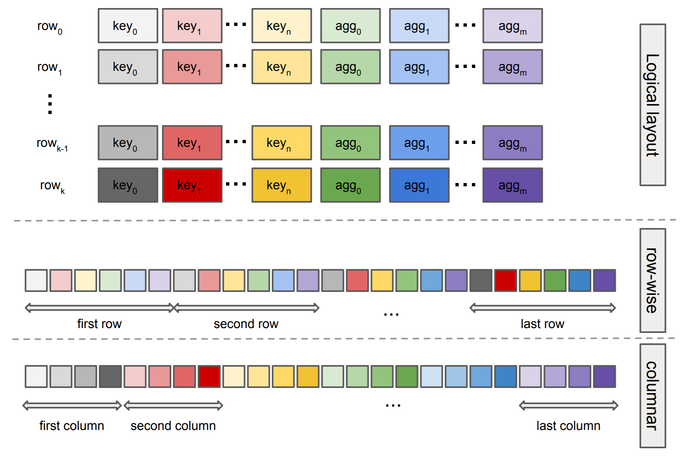

.. OmniSciDB Query Execution

==================================
Query Results
==================================

The final step of query execution is results processing. The query engine drives all result set processing through the ``ResultSet`` class. The ``ResultSet`` class includes method for results reduction, iteration, lazy fetch and string dictionary lookups, and serialization (Enterprise Edition only). 

As a hardware accelerated (i.e. parallelized) in memory database, several top-level considerations were made in designing the result set data model:

#. Group by queries constitute the most challenging type of query, as the computation within groups is typically high-contention (i.e. requires atomics or locks). To reduce contention, extra intermediate buffers are introduced during execution. Therefore, the result set reduction model needs to be able to efficiently handle reduction over various aggregate functions and on numerous intermediate buffers iteratively.
#. Transfer between CPU and GPU should not require transformations (to the extent possible). Because the CPU and GPU memory systems do not share an address space, no indirection is allowed. In other words, all offsets into the output buffer must be relative.
#. Since GPU devices are typically memory constrained relative to the compute available, size-efficiency is very important.

In this section we discuss the underlying data model that is used for handling results in the query engine and how results are processed (e.g. reduction or sort) and accessed.

Result Set Storage
------------------

The output from each device (see :doc:`./kernels`) is a ``ResultSet`` object. However, the underlying buffer for each result set is ``ResultSetStorage``; device outputs by default have only one attached ``ResultSetStorage`` object. The ``ResultSetStorage`` manages output buffers, stores some metadata about the initialization values and projected targets in the output buffers, and provides most of the low-level driver methods for reductions.

The ``ResultSetStorage`` owns a "flat" buffer stored as a byte stream. This particular choice makes the data transfer highly efficient to/form the GPU devices (using simple memory copy). However, storing the buffer as a byte stream means more helper methods and metadata are required to access specific data in the buffer. The ``QueryMemoryDescriptor`` (generated during code generation) assists ``ResultSetStorage`` in determining specific buffer layout attributes. For example, the ``QueryMemoryDescriptor`` encodes output target information, including the number of targets and the physical size (in the buffer) and logical size (size of the data type) for each target. A copy of some information is also available directly in ``ResultSetStorage``. For output targets, we encode type and initialization values in ``ResultSetStorage`` for fast lookups.

Logical Targets and Physical Slots
^^^^^^^^^^^^^^^^^^^^^^^^^^^^^^^^^^^^^^^^^

First, we define some terms:

* A **Slot** is the physical space in the output buffer where the output target data will be written. 
* **Logical target size** is the size required to store the output data as dictated by the SQL type of the output. For example, a projected target with SQL type `Double` would have a logical size of 8 Bytes. 
* **Physical slot size** is the size of the space in the output buffer for the target. The physical size must be *at least* equal to the logical size. 

Consider the following SQL query:

.. code-block:: sql

    CREATE TABLE test (x SMALLINT, y FLOAT);

    SELECT x, COUNT(*), AVG(y) FROM test GROUP BY x;

The following table contains one possible output buffer layout, described using the physical and logical sizes for the outputs. 

+-------------+--------------+--------------+
|Target       |  Logical Size| Physical Size|  
+=============+==============+==============+
|``x``        |  2 bytes     |  8 bytes     |
+-------------+--------------+--------------+
|``COUNT(*)`` |  4 bytes     |  8 bytes     |
+-------------+--------------+--------------+
|``AVG(y)``   |  8 bytes     | 8 bytes      |
+-------------+--------------+--------------+
|``AVG(y)``   |  8 bytes     | 8 bytes      |
+-------------+--------------+--------------+

.. note:: 
    OmniSciDB will attempt to allocate the most compact output buffer possible. In the above example, the 8 byte slots required for ``AVG`` are forcing 8 byte physical size for all outputs. 

The ``x`` and ``COUNT`` targets each require one slot in the output buffer and a physical size greater than our equal to their logical size. The ``AVG`` target requires two slots; one to compute the count, and one to compute a running sum. This allows ``AVG`` to be computed in parallel and reduced across multiple outputs. 

Other target types may also require multiple slots. For example. variable length columns (fixed length arrays, variable length arrays, and none-encoded strings) require multiple slots. 
.

Storage Memory Layouts
^^^^^^^^^^^^^^^^^^^^^^

OmniSciDB is a columnar database, meaning all inputs to the system are columns. However, output results can be stored in either `columnar` or `row-wise` order. The figure below depicts a simplified schematic representation of these two memory layouts using a hypothetical 
group by query with `n` group keys and `m` aggregates.

* In the **row-wise layout**, all physical slots belonging to the same row are consecutive in the memory.
* In the **columnar layout**, all the results for all returned rows are consecutive in memory for each physical slot.

Depending on the type of query, it is common to dedicate some extra portion of the storage buffer to store other related information.
For example, for projection queries we store the offset of the current row within each fragment. This information is later used for `lazy fetch` evaluation of targets that did not require computation (i.e. were not embedded in expressions) but were projected as part of the query.

Group by Queries
^^^^^^^^^^^^^^^^^

OmniSciDB supports two hash table layouts for group by queries: the **baseline** hash layout and the **perfect** hash layout. For perfect hash, the whole storage buffer is divided into indexed portions such that each portion can be accessed by one and only one set of keys. For a set of keys in a group by query, all possible indices can be upperbounded by the cross-product of each key's range (i.e., maximum subtracted by minimum). More specifically, for a set of grouped keys :math:`k_0, \dots, k_n`, each with maximum values of :math:`M_0, \dots, M_n` and minimum values of :math:`m_0, \dots, m_n` respectively, 
we can compute the unique index as: :math:`(k_0 - m_0) + (M_0 - m_0)(k_1 - m_1) + \dots + (M_0 - m_0) \dots (M_{n-1}-m_{n-1})(k_n - m_n)` 

Some indices may end up being unused as there may never be such combination of keys in the input data. However, since there exists an exclusive set of physical slots for each possible outcome, it turns out to be considerably efficient. The total size of the storage for these cases can be exactly computed by having the meta-data for each 
input column (e.g., having minimum and maximum of each column). If the memory layout is row-wise then all physical slots belonging to one index (equivalently belonging to a set of keys) 
are next to each other in memory. If the memory layout is columnar, after computing the unique index each particular slot can be exactly located by starting from the beginning offset of each column and moving forward until reaching the particular index in mind. 

Unfortunately, it is not possible to use such strategy for all group by queries, because the key ranges will eventually grow to exceed the available memory of the device. In such cases, we use the `baseline hash` layout, an open-addressing hash table (using the `Murmur hash function`) with linear probing and a 50% fill rate. If row-wise memory layout is used, we compute the slot in the output buffer as the output of the hash function over the set of grouped keys. If the output slot is already used, we incrementally increase the index until finding an unused one. For columnar output, once the index is computed, we locate separated portions of storage belonging to each slot (by starting from each column's global offset in the output buffer.

It is important to realize that the storage buffer is structurally the same regardless of the group by query type. The difference is only in the way we assign a set of group keys to those available indexed slots in the storage; for one case the assignment is unique, for the other the assignment is randomly chosen.

Reductions
----------

The ``ResultSet`` and ``ResultSetStorage`` classes include methods for aggregating multiple ``ResultSets`` (by aggregating their respective underlying storage). We refer to this process as `Reduction`. There are three types of reduction currently supported:

* **Append**: For projection queries, it is sufficient to append ``ResultSetStorage`` from one ``ResultSet`` to the other.
* **Non-grouped Aggregate**: A `non-grouped aggregate` query is an aggregate without a group by (e.g. `SELECT COUNT(*) from t`). Because there is no key, the reduction step reduces all results into a single row. 
* **Group By**: All ``ResultSetStorage`` objects are assumed to have the same buffer layout. Therefore, the buffer is walked and each row is reduced into the row from another ``ResultSetStorage`` object by accumulating each aggregate target. The accumulation step uses the same aggregate function as the kernel used to compute the value in the output buffer. 

Globally, the system reduces each output ``ResultSet`` from a kernel into a parent ``ResultSet`` sequentially. The actual reduction step is parallelized over the rows in the output buffer (except in the case of projections, where the append simply moves a smart pointer and does not involve physically copying or accessing large regions of memory).

Accessors and Iterators
------------------------
The `ResultSet` class provides an iterator method to walk the query output, as well as methods to access results directly at a specified row index. The iterator / accessor methods often require both knowledge of the output layout and knowledge of the target stored in the output slot. For example, the ``AVG`` aggregate function requires two output slots; one to compute a running count, and one to compute a running sum. During buffer iteration, the actual average value is computed by accessing the values from each slot and dividing. Similar processes are required to decode dictionary encoded strings.