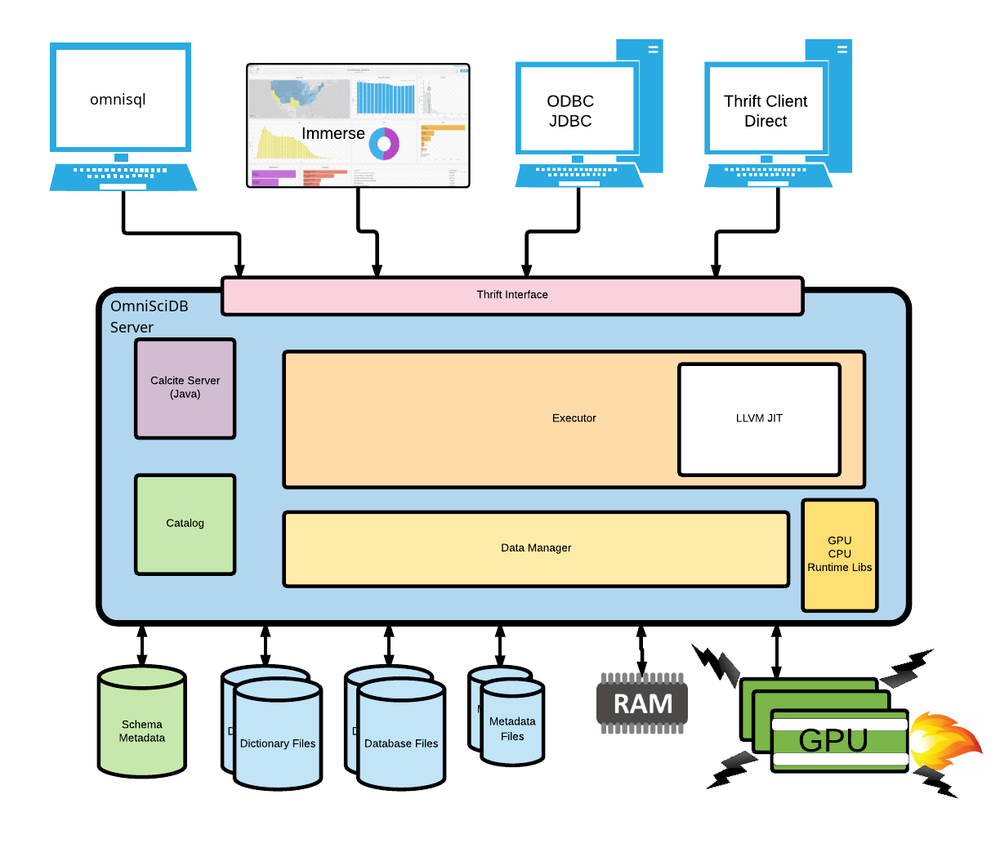

.. OmniSciDB System Overview

#########################
OmniSciDB at 30,000 Feet
#########################

OmniSciDB is made up of several high level components. A diagram illustrating most of the components of the system is displayed below, with a short description of each major section of the documentation following.

High Level Diagram
==================

The major components in the above diagram and their respective reference pages are listed in the table below.

.. list-table:: Component Reference
    :header-rows: 1

    * - Component
      - Reference Page
    * - Thrift Interface  
      - :doc:`../data_model/api`
    * - Calcite Server
      - :doc:`../calcite/calcite_parser`
    * - Catalog
      - :doc:`../catalog/index`
    * - Executor
      - :doc:`../execution/overview`
    * - LLVM JIT
      - :doc:`../execution/codegen`
    * - CPU / GPU Kernels 
      - :doc:`../execution/kernels`
    * - Database Files, Metadata Files, Dictionary Files
      - :doc:`../data_model/physical_layout`

Data Model
===========

The :doc:`../data_model/index` section provides an overview of the data formats and data types supported by OmniSciDB. A brief overview of various storage layer components is also included.

Data Flow
=========

The :doc:`../flow/data` section ties together the :doc:`../data_model/index` and :doc:`../execution/index` sections, providing information about the complete flow of data from the input columns for a query to its projected outputs.

Query Execution
==========================
The :doc:`../execution/index` section provides an overview
of how a query is executed inside OmniSciDB.

At a high-level, all SQL queries made to the server pass through the
Thrift_ `sql_execute` endpoint. The query string is passed to Apache Calcite_ 
for parsing and cost-based optimization, yielding an optimized relational 
algebra tree. This relational algebra tree is then passed through OmniSci-specific 
optimization passes and translated into an OmniSCi-specific abstract syntax tree (AST). 
The AST provides all the information necessary to generate native machine code for 
query execution on the target device. Execution then occurs in parallel on the target 
device, with device results being aggregated and reduced into a final `ResultSet`
for each query step.

The sections following provide in-depth details on each of the
stages involved in executing a query.

.. _Thrift: https://thrift.apache.org/
.. _Calcite: https://calcite.apache.org/
.. _Bison: https://www.gnu.org/software/bison/

Simplified Execution Model
======================

.. uml::
   :align: center

    @startuml
   
    start
   
    :Parse and Validate SQL;
   
    :Generate Optimized 
     Relational Algebra Sequence;
   
    :Prepare Execution Environment;
    
    repeat
        fork
            :Data Ownership, 
             Identification, 
             Load (as required);
            :Execute Query Kernel 
             on Target Device;
        fork again
            :Data Ownership, 
             Identification, 
             Load (as required);
            :Execute Query Kernel 
             on Target Device;
        fork again
            :Data Ownership, 
             Identification, 
             Load (as required);
            :Execute Query Kernel 
             on Target Device;
        end fork      
        :Reduce Result;

    while (Query Completed?)

    :Return Result;
    
    stop

    @enduml
