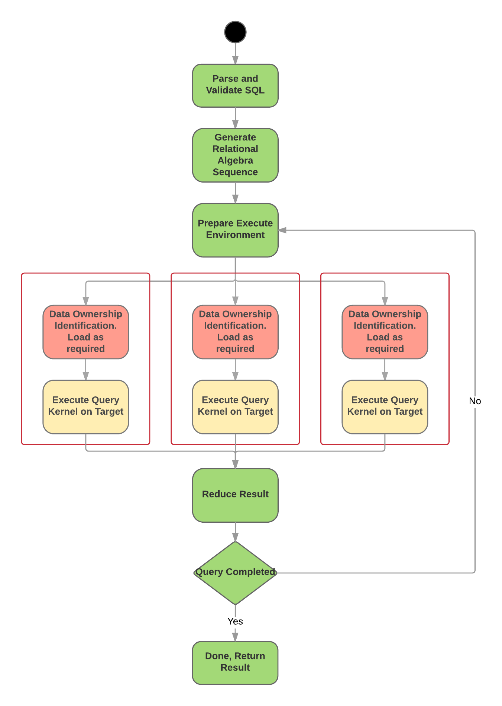

.. OmniSciDB Architecture Overview

==================================
OmniSciDB at 30,000 feet
==================================

Introduction to OmniSciDB
=========================

OmniSciDB is an open source SQL-based, relational, columnar database engine
that leverages the full performance and parallelism of modern hardware 
(both CPUs and GPUs) to enable querying of multi-billion row datasets in milliseconds,
without the need for indexing, pre-aggregation, or downsampling.

OmniSciDB can be run on hybrid CPU/GPU systems, as well as on CPU-only systems
featuring X86, Power, and ARM (experimental support) architectures. To achieve
maximum performance, OmniSciDB features multi-tiered caching of data between
storage, CPU memory, and GPU memory, and an innovative Just-In-Time (JIT) query
compilation framework.

This developer documentation provides an in-depth discussion of the OmniSciDB
internals, and details the data model and query execution flows.

High Level Diagram
==================

.. image:: ../img/platform_overview.png

Query Execution
==========================
The `Query Execution` section provides a high-level overview
of how a query is executed by the OmniSci server.

At a high-level, all queries made to the server pass through the
Thrift_ `sql_execute` endpoint. Once the query string is received,
it is then parsed, yielding a relational algebra tree. This relational
algebra tree is then optimized and prepared for execution
on either the CPU or the GPU. From here, the optimized relational
algebra is consumed by then codegen step, which produces code
suitable for executing the query on the target device.

A `ResultSet` is returned by the execution and is converted
to the corresponding `TResultSet` Thrift type before returning.

The sections following provide in-depth details on each of the
stages involved in executing a query.

.. _Thrift: https://thrift.apache.org/
.. _Calcite: https://calcite.apache.org/
.. _Bison: https://www.gnu.org/software/bison/

Simple Execution Model
======================

.. uml::

    @startuml
   
    start
   
    :Parse and Validate SQL;
   
    :Generate Optimized 
     Relational Algebra Sequence;
   
    :Prepare Execution Environment;
    
    repeat
        fork
            :Data Ownership, 
             Identification, 
             Load (as required);
            :Execute Query Kernel 
             on Target Device;
        fork again
            :Data Ownership, 
             Identification, 
             Load (as required);
            :Execute Query Kernel 
             on Target Device;
        fork again
            :Data Ownership, 
             Identification, 
             Load (as required);
            :Execute Query Kernel 
             on Target Device;
        end fork      
        :Reduce Result;

    while (Query Completed?)

    :Return Result;
    
    stop

    @enduml

